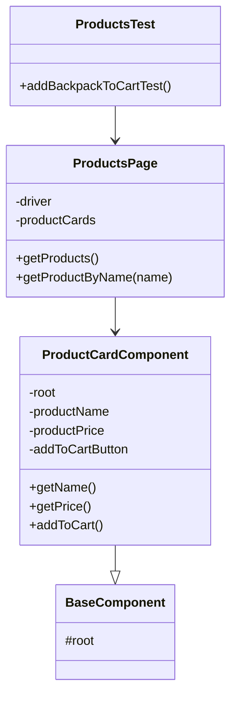
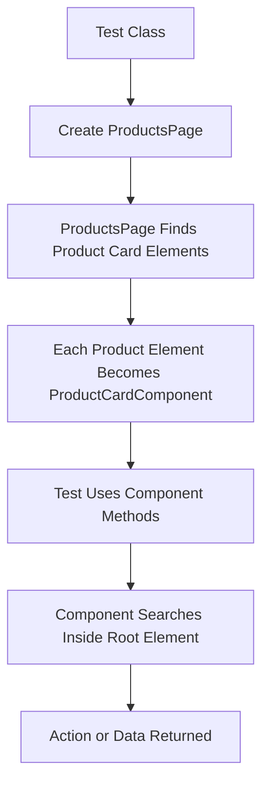
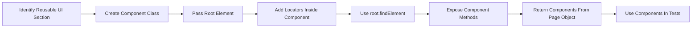

# Page Component Model

> A UI test automation pattern that extends Page Object Model by representing reusable page sections as separate component classes.

---

## Table of Contents

- [Note on Naming](#note-on-naming)
- [Definition](#1-definition)
- [Problem](#2-problem)
- [Solution](#3-solution)
- [Structure](#4-structure)
- [Applicability](#5-applicability)
- [How to Implement](#6-how-to-implement)
- [Pros and Cons](#7-pros-and-cons)
- [Page Object Model vs Page Component Model](#page-object-model-vs-page-component-model)
- [Summary](#summary)
- [References](#references)

---

## Note on Naming

The term **Page Component Model** is not a GoF design pattern name. It is a test automation architecture style built on top of the **Page Object Model**.

In Selenium’s official documentation, the name used is **Page Component Objects**. Other teams may also call the same idea:

- **Page Components**
- **Component Objects**
- **Component Page Object Model**
- **Panel Objects**
- **Fragment Objects**

The most accurate wording for Selenium Java automation is:

> **Page Component Objects are smaller objects that represent reusable or repeated parts of a page.**

This idea is closely related to Martin Fowler’s explanation that a Page Object can wrap an HTML page **or fragment**, and that Page Objects do not always need to represent full pages only.

---

## 1. Definition

The **Page Component Model** is a UI test automation pattern where a large page is divided into smaller, reusable component classes.

A component can represent a meaningful section of the UI, such as:

- Header
- Footer
- Navigation menu
- Product card
- Search box
- Filter panel
- Modal dialog
- Cart item
- Sidebar
- Table row

Instead of putting every locator and every action inside one large Page Object class, each reusable section gets its own class.

The main Page Object then **has** these components or returns them when needed.

This relationship is called **composition**:

```text
ProductsPage has ProductCardComponent objects
HomePage has HeaderComponent
CartPage has CartItemComponent objects
```

---

## 2. Problem

Normal Page Object Model works well at the beginning, but large pages can easily create large classes.

Example: an e-commerce `ProductsPage` may contain locators and methods for:

- Header
- Login menu
- Product cards
- Product prices
- Add-to-cart buttons
- Cart badge
- Filters
- Sorting dropdown
- Footer

This can produce a page class with too many responsibilities.

### Without Page Components

```java
public class ProductsPage {

    private WebDriver driver;

    private By headerLogo = By.className("logo");
    private By searchInput = By.id("search");
    private By cartIcon = By.id("cart");
    private By productCards = By.className("inventory_item");
    private By productName = By.className("inventory_item_name");
    private By productPrice = By.className("inventory_item_price");
    private By addToCartButton = By.tagName("button");
    private By footerLinks = By.cssSelector("footer a");

    public ProductsPage(WebDriver driver) {
        this.driver = driver;
    }

    public void search(String keyword) {
        driver.findElement(searchInput).sendKeys(keyword);
    }

    public void openCart() {
        driver.findElement(cartIcon).click();
    }

    public String getFirstProductName() {
        return driver.findElements(productCards)
                .get(0)
                .findElement(productName)
                .getText();
    }

    public String getFirstProductPrice() {
        return driver.findElements(productCards)
                .get(0)
                .findElement(productPrice)
                .getText();
    }

    public void addFirstProductToCart() {
        driver.findElements(productCards)
                .get(0)
                .findElement(addToCartButton)
                .click();
    }
}
```

### The Problem

This design has several problems:

- The Page Object becomes too large.
- The page class handles unrelated UI sections.
- Product-card logic is mixed with header, cart, and footer logic.
- Repeated UI sections are hard to reuse on other pages.
- Any common component change may require updates in many Page Objects.

If the same header, menu, modal, table row, or product card appears on multiple pages, duplicated locators and actions become difficult to maintain.

---

## 3. Solution

The solution is to move each repeated or meaningful UI section into its own component class.

Each component class should contain:

- A **root element** representing the whole component.
- Locators that are searched inside that root element.
- Methods that represent actions or information related to that component.

The Page Object becomes responsible for page-level behavior and for returning components.

### Example Idea

```java
ProductsPage productsPage = new ProductsPage(driver);

ProductCardComponent backpack = productsPage.getProductByName("Sauce Labs Backpack");

Assert.assertEquals(backpack.getPrice(), "$29.99");
backpack.addToCart();
```

The test does not need to know how the product card is structured internally.

---

## 4. Structure

### Components

| Component | Role |
|---|---|
| **Test Class** | Contains the test scenario and assertions |
| **Page Object** | Represents the full page or major screen |
| **Component Object** | Represents a smaller reusable part of the page |
| **Root Element** | The parent `WebElement` that contains the component |
| **Component Locators** | Locators searched relative to the root element |
| **Component Methods** | Actions or data exposed by the component |

---

### Class Diagram



---

### Object Creation Flow



---

### Project Structure Example

```text
src/test/java
├── base
│   └── BaseTest.java
├── components
│   ├── BaseComponent.java
│   └── ProductCardComponent.java
├── pages
│   └── ProductsPage.java
└── tests
    └── ProductsTest.java
```

---

## Simple Java Selenium TestNG Example

### 1. Base Component

```java
package components;

import org.openqa.selenium.WebElement;

public abstract class BaseComponent {

    protected WebElement root;

    public BaseComponent(WebElement root) {
        this.root = root;
    }
}
```

---

### 2. Product Card Component

```java
package components;

import org.openqa.selenium.By;
import org.openqa.selenium.WebElement;

public class ProductCardComponent extends BaseComponent {

    private By productName = By.className("inventory_item_name");
    private By productPrice = By.className("inventory_item_price");
    private By addToCartButton = By.tagName("button");

    public ProductCardComponent(WebElement root) {
        super(root);
    }

    public String getName() {
        return root.findElement(productName).getText();
    }

    public String getPrice() {
        return root.findElement(productPrice).getText();
    }

    public void addToCart() {
        root.findElement(addToCartButton).click();
    }
}
```

---

### 3. Products Page Object

```java
package pages;

import components.ProductCardComponent;
import org.openqa.selenium.By;
import org.openqa.selenium.WebDriver;
import org.openqa.selenium.WebElement;

import java.util.List;
import java.util.stream.Collectors;

public class ProductsPage {

    private WebDriver driver;

    private By productCards = By.className("inventory_item");

    public ProductsPage(WebDriver driver) {
        this.driver = driver;
    }

    public List<ProductCardComponent> getProducts() {
        List<WebElement> products = driver.findElements(productCards);

        return products.stream()
                .map(ProductCardComponent::new)
                .collect(Collectors.toList());
    }

    public ProductCardComponent getProductByName(String productName) {
        return getProducts().stream()
                .filter(product -> product.getName().equals(productName))
                .findFirst()
                .orElseThrow(() -> new RuntimeException("Product not found: " + productName));
    }
}
```

---

### 4. Base Test

```java
package base;

import org.openqa.selenium.WebDriver;
import org.openqa.selenium.chrome.ChromeDriver;
import org.testng.annotations.AfterMethod;
import org.testng.annotations.BeforeMethod;

public class BaseTest {

    protected WebDriver driver;

    @BeforeMethod
    public void setUp() {
        driver = new ChromeDriver();
        driver.manage().window().maximize();
        driver.get("https://www.saucedemo.com/inventory.html");
    }

    @AfterMethod
    public void tearDown() {
        if (driver != null) {
            driver.quit();
        }
    }
}
```

> Note: In a real project, the login step should be handled before opening the inventory page. This example focuses only on the component structure.

---

### 5. Test Class

```java
package tests;

import base.BaseTest;
import components.ProductCardComponent;
import org.testng.Assert;
import org.testng.annotations.Test;
import pages.ProductsPage;

public class ProductsTest extends BaseTest {

    @Test
    public void addBackpackToCartTest() {
        ProductsPage productsPage = new ProductsPage(driver);

        ProductCardComponent backpack = productsPage.getProductByName("Sauce Labs Backpack");

        Assert.assertEquals(backpack.getPrice(), "$29.99");

        backpack.addToCart();
    }
}
```

In this design, the `ProductsPage` does not manage every detail inside every product card. It returns `ProductCardComponent` objects, and each component handles its own internal locators and actions.

---

## 5. Applicability

Use the Page Component Model when:

- A page contains repeated UI sections.
- A Page Object is becoming too large.
- The same UI component appears on multiple pages.
- You want to reduce duplicated locator code.
- You want your automation structure to match the real UI structure.
- The application is built with reusable components, such as React, Angular, Vue, or a design system.
- You have complex pages with cards, modals, panels, tabs, menus, rows, or widgets.

### Real Automation Examples

| UI Case | Component Class Example |
|---|---|
| Product card repeated in a product list | `ProductCardComponent` |
| Header used across many pages | `HeaderComponent` |
| Modal dialog used in several flows | `ModalComponent` |
| Table rows with actions | `TableRowComponent` |
| Sidebar filters | `FilterPanelComponent` |
| Cart item in checkout | `CartItemComponent` |

---

## 6. How to Implement



### Step-by-step

1. Start with a normal Page Object.
2. Identify repeated or meaningful sections inside the page.
3. Create a component class for each section.
4. Pass the component root `WebElement` into the component constructor.
5. Store locators inside the component class.
6. Use `root.findElement()` or `root.findElements()` inside the component.
7. Keep page-level navigation and page-level actions inside the Page Object.
8. Return component objects from the Page Object.
9. Keep assertions in the test class.
10. Reuse the same component class on other pages when the same UI section appears again.

### Important Rule

Do not search from the full driver when locating elements inside a component.

Prefer this:

```java
root.findElement(productName).getText();
```

Instead of this:

```java
driver.findElement(productName).getText();
```

Searching from the root keeps the locator scoped to that specific component.

---

## 7. Pros and Cons

### ✅ Pros

- Reduces duplicated locator code.
- Keeps Page Objects smaller and cleaner.
- Makes repeated UI sections reusable.
- Improves maintainability in large test suites.
- Uses composition instead of forcing everything into inheritance.
- Makes tests read closer to real user behavior.
- Works well with modern component-based UI applications.
- Supports nested components for complex pages.

### ❌ Cons

- Adds more classes to the framework.
- Can be over-engineered for small pages.
- Poor component boundaries can make the framework confusing.
- Too many nested components can make test flow harder to trace.
- Components still require maintenance when the UI changes.
- Root `WebElement` references can become stale if the DOM re-renders; in highly dynamic pages, you may need to relocate the component before using it again.

---

## Page Object Model vs Page Component Model

| Point | Page Object Model | Page Component Model |
|---|---|---|
| Main idea | One class represents a page or page-level service | Smaller classes represent parts of a page |
| Best for | Simple pages and page-level flows | Complex pages and repeated UI sections |
| Reuse level | Page-level reuse | Component-level reuse |
| Example | `LoginPage`, `ProductsPage` | `HeaderComponent`, `ProductCardComponent`, `CartItemComponent` |
| Relationship | Test uses Page Object | Page Object has Component Objects |
| Main benefit | Separates test logic from UI logic | Reduces large Page Objects and duplicated component logic |
| Main risk | Page Object can become too large | Too many small classes if overused |

---

## Summary

The **Page Component Model** improves the Page Object Model by breaking large pages into smaller reusable component objects.

Each component owns its root element, locators, and actions. The main Page Object organizes these components and exposes them to the test when needed.

This approach is especially useful when pages contain repeated UI sections, such as product cards, navigation bars, modals, table rows, filters, and cart items.

The key idea is simple:

> A Page Object represents the page. A Component Object represents a meaningful part of the page.

Used correctly, this keeps Selenium Java TestNG frameworks cleaner, more reusable, and easier to maintain.

---

## References

| Source | Link |
|---|---|
| Selenium Official Documentation — Page Object Models and Page Component Objects | https://www.selenium.dev/documentation/test_practices/encouraged/page_object_models/ |
| Martin Fowler — Page Object | https://martinfowler.com/bliki/PageObject.html |
| Playwright Java Official Documentation — Page Object Models | https://playwright.dev/java/docs/pom |
| WebdriverIO Official Documentation — Page Object Pattern | https://webdriver.io/docs/pageobjects/ |
