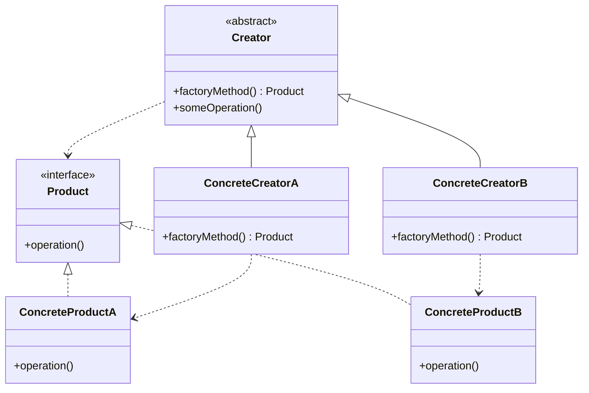
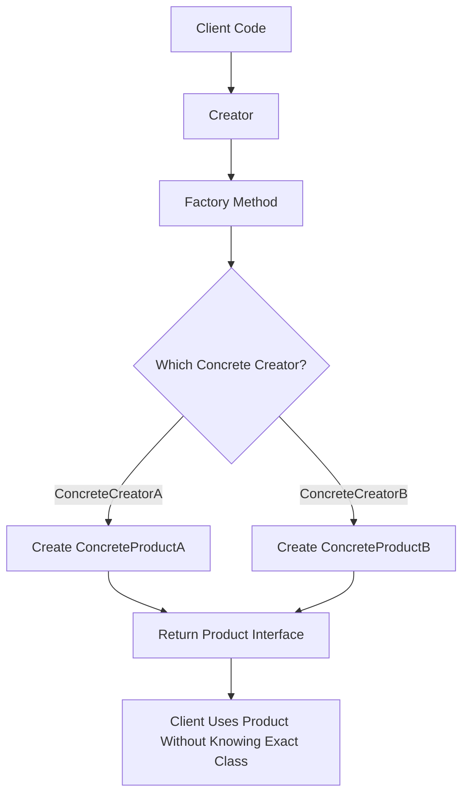

# Factory Method Pattern

> A creational design pattern that defines an interface for creating objects, but lets subclasses decide which class to instantiate.

---

## Table of Contents

- [Note on Naming](#note-on-naming)
- [Definition](#1-definition)
- [Problem](#2-problem)
- [Solution](#3-solution)
- [Structure](#4-structure)
- [Applicability](#5-applicability)
- [How to Implement](#6-how-to-implement)
- [Pros and Cons](#7-pros-and-cons)
- [Summary](#summary)
- [References](#references)

---

## Note on Naming

The term **Factory Pattern** is overloaded — it can refer to **Simple Factory**, **Factory Method**, or **Abstract Factory**. In classic GoF terminology, the most commonly referenced "Factory Pattern" is the **Factory Method Pattern**, which is the focus of this document.

The key distinction:
- **Factory Method** — creates a single product type via subclass polymorphism (inheritance-based).
- **Abstract Factory** — creates *families* of related products (composition-based).
- **Static Factory Method** — a static method that returns an object; a common Java idiom but **not** the GoF Factory Method Pattern.

---

## 1. Definition

The **Factory Method Pattern** is a **creational design pattern** that defines an interface or abstract method for creating objects in a superclass, while allowing subclasses to decide which concrete class should be instantiated.

Instead of creating objects directly using `new` in client code, object creation is delegated to a factory method.

> GoF definition: *"Define an interface for creating an object, but let subclasses decide which class to instantiate. Factory Method lets a class defer instantiation to subclasses."*

---

## 2. Problem

In many applications, code needs to create objects, but the exact type may not be known until runtime.

**Example:** A logistics system that supports different transportation methods — Truck, Ship, and Airplane — where each type has different behavior, but the client code should not be tightly connected to specific classes.

Without the Factory Method Pattern:

```java
Transport transport = new Truck(); // tight coupling to a concrete class
```

If the application later needs to support a new transport type, the client code must be changed in many places. The Factory Method Pattern solves this by moving object creation into a dedicated method.

---

## 3. Solution

Define a common interface for the products, then create a factory method that returns objects through that common type. Subclasses override the factory method to decide which concrete object to create — so the client code depends on abstractions, not concrete classes.

### Example

```java
// Product interface
interface Transport {
    void deliver();
}

// Concrete Product 1
class Truck implements Transport {
    public void deliver() {
        System.out.println("Delivering by land using a truck.");
    }
}

// Concrete Product 2
class Ship implements Transport {
    public void deliver() {
        System.out.println("Delivering by sea using a ship.");
    }
}

// Creator — abstract class with the factory method
abstract class Logistics {

    // Factory Method
    public abstract Transport createTransport();

    public void planDelivery() {
        Transport transport = createTransport();
        transport.deliver();
    }
}

// Concrete Creator 1
class RoadLogistics extends Logistics {
    public Transport createTransport() {
        return new Truck();
    }
}

// Concrete Creator 2
class SeaLogistics extends Logistics {
    public Transport createTransport() {
        return new Ship();
    }
}

// Client code
public class Main {
    public static void main(String[] args) {
        Logistics logistics = new RoadLogistics();
        logistics.planDelivery(); // Delivering by land using a truck.

        logistics = new SeaLogistics();
        logistics.planDelivery(); // Delivering by sea using a ship.
    }
}
```

---

## 4. Structure

### Components

| Component | Role |
|---|---|
| **Product** | Common interface for all objects the factory method can create |
| **Concrete Product** | The actual object instantiated, e.g. `Truck` or `Ship` |
| **Creator** | Declares the factory method; may also contain business logic using the product |
| **Concrete Creator** | Overrides the factory method to return a specific concrete product |

### Class Diagram



### Object Creation Flow



---

## 5. Applicability

Use the Factory Method Pattern when:

- The exact type of object needed is not known until runtime.
- You want to avoid direct dependency on concrete classes.
- You want to centralize and encapsulate object creation logic.
- You want subclasses to control which objects are created.
- You expect the system to grow with new product types over time.
- You want client code to work against interfaces or abstract classes.

### Real-World Examples

**Java `java.util.concurrent.ThreadFactory`**

`ThreadFactory` is a genuine GoF Factory Method example. It declares the factory method `newThread(Runnable r)`, and different concrete implementations create different types of threads — the client code works against the `Thread` product interface without knowing the concrete type being created.

```java
public interface ThreadFactory {
    Thread newThread(Runnable r); // factory method
}
```

**Java `javax.xml.parsers.DocumentBuilderFactory`**

`DocumentBuilderFactory` is an abstract creator class with `newDocumentBuilder()` as the factory method. Calling `DocumentBuilderFactory.newInstance()` returns a locale-specific concrete subclass, and `newDocumentBuilder()` is then overridden to produce different parser implementations. The client always works through the abstract `DocumentBuilder` type.

> ⚠️ **Common misconception:** `NumberFormat.getInstance()` and similar Java methods are often cited as Factory Method examples, but they are **static factory methods** — a different concept. Joshua Bloch clarified in *Effective Java*: *"A static factory method is not the same as the Factory Method pattern from Design Patterns."* Static methods cannot be overridden by subclasses, so they do not use the inheritance-based polymorphism that defines the GoF pattern.

---

## 6. How to Implement


**Step-by-step:**

1. Create a common interface or abstract class for the product.
2. Create concrete product classes that implement the product interface.
3. Create an abstract creator class.
4. Add a factory method inside the creator that returns the product interface type.
5. Create concrete creator classes that extend the abstract creator.
6. Override the factory method in each concrete creator to return a specific product.
7. Let client code use the creator and product interface — never concrete product classes directly.

---

## 7. Pros and Cons

### ✅ Pros

- Reduces tight coupling between client code and concrete classes.
- Makes object creation more flexible and extensible.
- Supports the **Open/Closed Principle** — new product types are added via new concrete creators, without modifying existing code.
- Centralizes object creation logic rather than scattering `new` calls across the codebase.
- Makes the system easier to extend as product types grow.

### ❌ Cons

- Increases the number of classes in the project (one new creator per product type).
- Can add unnecessary complexity for simple applications where object creation is unlikely to change.
- Requires inheritance in the classic form — less flexible than composition-based approaches.
- The client may still need to select and instantiate the correct concrete creator.
- Can be over-engineered for cases where a simple constructor or static method would suffice.

---

## Summary

The **Factory Method Pattern** is useful when a program needs to create objects without tightly coupling the client code to specific concrete classes. It moves object creation into a factory method and lets subclasses decide which object to produce — making the system more flexible, reusable, and easier to extend over time.

The key distinction from related patterns: Factory Method uses **inheritance** (subclasses override a method), while Abstract Factory uses **composition** (an object delegates to a factory object), and a static factory method is simply a named static utility that creates objects but has no GoF equivalent.

---

## References

| Source | Link |
|---|---|
| Refactoring.Guru — Factory Method Pattern | https://refactoring.guru/design-patterns/factory-method |
| Refactoring.Guru — Factory Method vs Static Factory | https://refactoring.guru/design-patterns/factory-comparison |
| Refactoring.Guru — Factory Method in Java | https://refactoring.guru/design-patterns/factory-method/java/example |
| Microsoft Learn — Design Patterns: Factories | https://learn.microsoft.com/en-us/shows/visual-studio-toolbox/design-patterns-factories |
| Oracle Java Docs — `DocumentBuilderFactory` | https://docs.oracle.com/javase/8/docs/api/javax/xml/parsers/DocumentBuilderFactory.html |
| Oracle Java Docs — `ThreadFactory` | https://docs.oracle.com/javase/8/docs/api/java/util/concurrent/ThreadFactory.html |
| Effective Java (Bloch) — Static Factory Methods vs GoF | https://www.oreilly.com/library/view/effective-java/9780134686097/ |
