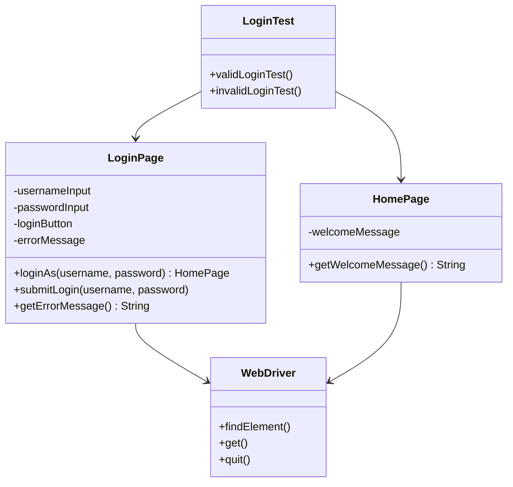
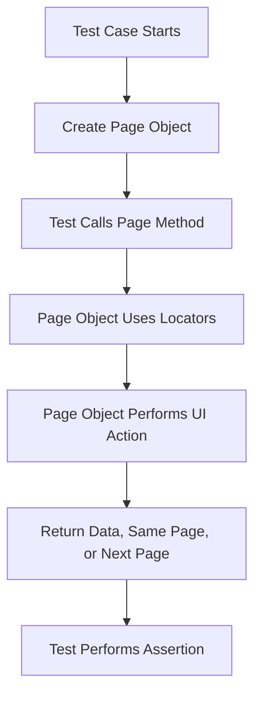
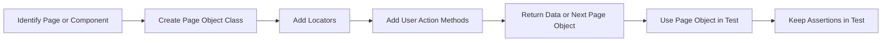

# Page Object Model Pattern

> A test automation design pattern that represents a page, screen, or meaningful UI component as a class, separating test logic from UI interaction logic.

---

## Table of Contents

- [Note on Naming](#note-on-naming)
- [Definition](#1-definition)
- [Problem](#2-problem)
- [Solution](#3-solution)
- [Structure](#4-structure)
- [Applicability](#5-applicability)
- [How to Implement](#6-how-to-implement)
- [Pros and Cons](#7-pros-and-cons)
- [Summary](#summary)
- [References](#references)

---

## Note on Naming

The **Page Object Model** is also commonly called the **Page Object Pattern**.

It is important to understand that **Page Object Model is not one of the original GoF design patterns**. It is a widely used **test automation design pattern** for UI automation frameworks such as Selenium, Playwright, Cypress, and Appium.

The key distinction:

- **Page Object Model** — separates test scenarios from page locators and UI interaction details.
- **Page Factory** — a Selenium support class that can help initialize page elements, but it is not required to use the Page Object Model.
- **UI Component Object / Page Component Object** — represents a reusable part of a page, such as a header, menu, card, filter panel, or cart item.

---

## 1. Definition

The **Page Object Model** is a test automation design pattern where each important web page, screen, or meaningful page section is represented as a class.

That class contains:

- The locators used to identify UI elements.
- The methods used to interact with those elements.
- A readable API that describes what the user can do on the page.

Instead of allowing test cases to interact directly with buttons, fields, links, and locators, the test calls page methods such as:

```java
loginPage.loginAs("admin", "1234");
```

Martin Fowler describes a Page Object as an object that wraps an HTML page or fragment with an application-specific API, allowing tests to manipulate page elements without directly depending on the HTML structure.

Selenium’s documentation explains that tests should be written from the user’s point of view, while page objects contain the page-specific information and actions needed to perform those user operations.

---

## 2. Problem

Automated UI tests become hard to maintain when locators and browser actions are written directly inside test cases.

Without Page Object Model:

```java
driver.findElement(By.id("username")).sendKeys("admin");
driver.findElement(By.id("password")).sendKeys("1234");
driver.findElement(By.id("loginBtn")).click();
```

This creates several problems:

- The test knows too much about the page structure.
- Locators are repeated across many test classes.
- A small UI change can force updates in many tests.
- Test cases become harder to read because business intent is mixed with low-level Selenium commands.
- Maintenance becomes slower as the automation suite grows.

The main issue is **tight coupling between test logic and UI implementation details**.

---

## 3. Solution

Create a separate class for each important page or page component.

The page object hides the locators and exposes meaningful methods that describe user actions.

Instead of this:

```java
driver.findElement(By.id("username")).sendKeys("admin");
driver.findElement(By.id("password")).sendKeys("1234");
driver.findElement(By.id("loginBtn")).click();
```

The test becomes this:

```java
HomePage homePage = loginPage.loginAs("admin", "1234");
```

The test now focuses on **what the user does**, while the page object handles **how the UI action is performed**.

### Example

> The following Selenium Java TestNG example is structurally correct. Replace the URL and locators with real values from your application.

```java
// BaseTest.java
import org.openqa.selenium.WebDriver;
import org.openqa.selenium.chrome.ChromeDriver;
import org.testng.annotations.AfterMethod;
import org.testng.annotations.BeforeMethod;

public class BaseTest {

    protected WebDriver driver;

    @BeforeMethod
    public void setUp() {
        driver = new ChromeDriver();
        driver.manage().window().maximize();
        driver.get("https://example.com/login");
    }

    @AfterMethod(alwaysRun = true)
    public void tearDown() {
        if (driver != null) {
            driver.quit();
        }
    }
}
```

```java
// LoginPage.java
import org.openqa.selenium.By;
import org.openqa.selenium.WebDriver;

public class LoginPage {

    private final WebDriver driver;

    private final By usernameInput = By.id("username");
    private final By passwordInput = By.id("password");
    private final By loginButton = By.id("loginBtn");
    private final By errorMessage = By.id("error");

    public LoginPage(WebDriver driver) {
        this.driver = driver;
    }

    public HomePage loginAs(String username, String password) {
        driver.findElement(usernameInput).sendKeys(username);
        driver.findElement(passwordInput).sendKeys(password);
        driver.findElement(loginButton).click();

        return new HomePage(driver);
    }

    public void submitLogin(String username, String password) {
        driver.findElement(usernameInput).sendKeys(username);
        driver.findElement(passwordInput).sendKeys(password);
        driver.findElement(loginButton).click();
    }

    public String getErrorMessage() {
        return driver.findElement(errorMessage).getText();
    }
}
```

```java
// HomePage.java
import org.openqa.selenium.By;
import org.openqa.selenium.WebDriver;

public class HomePage {

    private final WebDriver driver;

    private final By welcomeMessage = By.id("welcome");

    public HomePage(WebDriver driver) {
        this.driver = driver;
    }

    public String getWelcomeMessage() {
        return driver.findElement(welcomeMessage).getText();
    }
}
```

```java
// LoginTest.java
import org.testng.Assert;
import org.testng.annotations.Test;

public class LoginTest extends BaseTest {

    @Test
    public void validLoginTest() {
        LoginPage loginPage = new LoginPage(driver);

        HomePage homePage = loginPage.loginAs("admin", "1234");

        Assert.assertEquals(homePage.getWelcomeMessage(), "Welcome admin");
    }

    @Test
    public void invalidLoginTest() {
        LoginPage loginPage = new LoginPage(driver);

        loginPage.submitLogin("admin", "wrongPassword");

        Assert.assertEquals(loginPage.getErrorMessage(), "Invalid username or password");
    }
}
```

---

## 4. Structure

### Components

| Component | Role |
|---|---|
| **Test Class** | Contains the test scenario and assertions |
| **Page Object Class** | Represents a page, screen, or meaningful page section |
| **Locators** | Identify UI elements such as fields, buttons, links, and messages |
| **Page Methods** | Represent user actions or readable page data |
| **Page Component Object** | Represents reusable page sections such as menus, cards, headers, or tables |
| **WebDriver / Browser Page** | The browser automation object used internally by the page object |

### Class Diagram



### Object Interaction Flow



---

## 5. Applicability

Use the Page Object Model when:

- You are writing UI automation tests.
- Multiple tests interact with the same page or component.
- Locators are duplicated across many test classes.
- Test methods are becoming long and hard to read.
- You want tests to describe user behavior instead of browser mechanics.
- You want UI locator changes to be handled in one place.
- You are building a maintainable Selenium, Playwright, Cypress, or Appium framework.
- Your test suite is growing and needs a clearer structure.

### Real-World Examples

**Selenium UI Automation**

A `LoginPage` class hides username, password, login button, and error message locators. Tests call methods such as `loginAs()` and `getErrorMessage()` instead of using `driver.findElement()` directly.

**Playwright UI Automation**

Playwright’s documentation also recommends Page Object Models as one approach for structuring larger test suites. Page objects keep selectors in one place and provide reusable methods around the Playwright `Page` object.

**Page Component Objects**

A large page can be broken into smaller component objects, such as:

- `HeaderComponent`
- `SidebarMenuComponent`
- `ProductCardComponent`
- `CartItemComponent`
- `FilterPanelComponent`

This avoids creating one huge page object class.

---

## 6. How to Implement



**Step-by-step:**

1. Identify the pages or components used in your tests.
2. Create one class for each important page or component.
3. Inject or pass the browser driver/page object through the constructor.
4. Add locators inside the page object class.
5. Create methods that represent user actions, not technical clicks only.
6. Return the next page object when an action causes navigation.
7. Return simple data types when the test needs to assert page state.
8. Keep test assertions inside the test class.
9. Allow only page-load or critical-element validation inside the page object if needed.
10. Reuse the page object across multiple tests.
11. Update the page object when the UI changes instead of updating every test.

### Good Page Method Names

| Weak Method Name | Better Method Name |
|---|---|
| `clickButton()` | `clickLogin()` |
| `typeText()` | `enterUsername()` |
| `clickSubmit()` | `submitLogin()` |
| `doLogin()` | `loginAs(username, password)` |
| `readText()` | `getErrorMessage()` |

### Important Rule About Assertions

In general, **page objects should not contain test assertions**.

Assertions belong in the test class because the test class defines what behavior is being verified.

Acceptable exception:

- A page object constructor or load method may verify that the correct page or critical elements loaded successfully.

Avoid this inside page objects:

```java
Assert.assertEquals(getErrorMessage(), "Invalid username or password");
```

Prefer this:

```java
Assert.assertEquals(loginPage.getErrorMessage(), "Invalid username or password");
```

---

## 7. Pros and Cons

### ✅ Pros

- Improves test readability.
- Reduces duplicated locator code.
- Separates test logic from UI interaction logic.
- Makes tests easier to maintain when the UI changes.
- Encourages reusable page and component classes.
- Helps tests describe user behavior instead of technical browser actions.
- Makes large automation suites easier to organize.
- Supports cleaner framework structure.

### ❌ Cons

- Adds more classes to the project.
- Poorly designed page objects can become too large.
- Overusing page objects for tiny or temporary pages can add unnecessary complexity.
- If assertions are placed inside page objects, responsibilities become mixed.
- Page objects still need maintenance when the UI changes.
- A badly named page method can hide too much and make debugging harder.
- It may be unnecessary for very small or short-lived test suites.

---

## Summary

The **Page Object Model** is one of the most important patterns in UI test automation. It separates test scenarios from page structure and UI interaction details.

Tests should focus on user behavior and assertions. Page objects should handle locators and page actions.

The main benefit is maintainability: when the UI changes, you usually update the page object instead of editing many test cases.

The key distinction from GoF patterns: Page Object Model is not a GoF pattern. It is a practical automation design pattern used to build cleaner and more maintainable UI test suites.

---

## References

| Source | Link |
|---|---|
| Selenium Official Documentation — Page Object Models | https://www.selenium.dev/documentation/test_practices/encouraged/page_object_models/ |
| Selenium Official Documentation — Overview of Test Automation | https://www.selenium.dev/documentation/test_practices/overview/ |
| Selenium Java API — PageFactory | https://www.selenium.dev/selenium/docs/api/java/org/openqa/selenium/support/PageFactory.html |
| Playwright Official Documentation — Page Object Models | https://playwright.dev/docs/pom |
| Martin Fowler — Page Object | https://martinfowler.com/bliki/PageObject.html |
