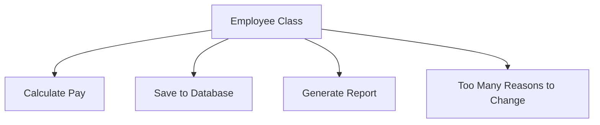
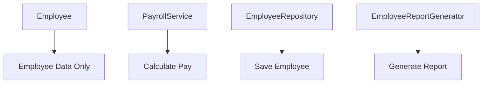
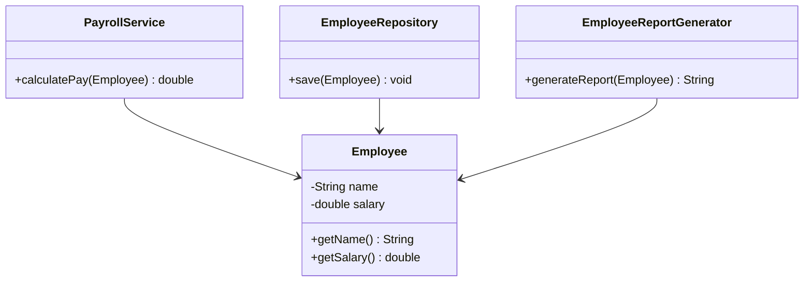
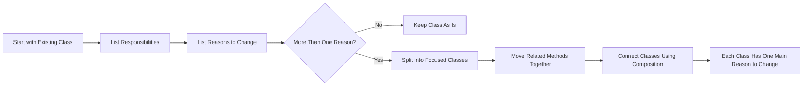

# Single Responsibility Principle

> A SOLID object-oriented design principle that says a class or module should have one focused responsibility and one reason to change.

---

## Table of Contents

- [Note on Classification](#note-on-classification)
- [Definition](#1-definition)
- [Problem](#2-problem)
- [Solution](#3-solution)
- [Structure](#4-structure)
- [Applicability](#5-applicability)
- [How to Implement](#6-how-to-implement)
- [Pros and Cons](#7-pros-and-cons)
- [Example in Test Automation](#8-example-in-test-automation)
- [Summary](#summary)
- [References](#references)

---

## Note on Classification

The **Single Responsibility Principle**, usually abbreviated as **SRP**, is the **S** in **SOLID**.

SRP is **not a design pattern** by itself. It is an object-oriented design principle used to make code easier to understand, test, maintain, and change.

A design pattern gives a reusable solution structure for a recurring design problem. A design principle gives a general rule or guideline for writing better software.

In automation frameworks, SRP helps separate responsibilities such as:

- Test scenarios
- Page interactions
- Driver creation
- Test data management
- API calls
- Database checks
- Reporting
- Configuration

---

## 1. Definition

The **Single Responsibility Principle** says that a class, module, or component should have **one focused responsibility** and **one reason to change**.

Robert C. Martin explains SRP as:

> “The Single Responsibility Principle (SRP) states that each software module should have one and only one reason to change.”

He also clarifies the practical meaning of SRP:

> “Gather together the things that change for the same reasons. Separate those things that change for different reasons.”

In simple words:

> A class should do one focused job, and changes to that class should come from one main reason.

---

## 2. Problem

A class violates SRP when it handles multiple unrelated responsibilities.

### Bad Example

```java
class Employee {

    public double calculatePay() {
        return 0;
    }

    public void saveToDatabase() {
        System.out.println("Saving employee to database");
    }

    public String generateReport() {
        return "Employee report";
    }
}
```

This class has more than one responsibility:

| Method | Responsibility |
|---|---|
| `calculatePay()` | Salary calculation |
| `saveToDatabase()` | Data persistence |
| `generateReport()` | Report generation |

The problem is that each responsibility may change for a different reason:

- Salary rules may change because of finance requirements.
- Database logic may change because of technical infrastructure.
- Report format may change because of management or auditing needs.

When unrelated responsibilities live in the same class, one change can accidentally affect another feature.

---

## 3. Solution

The solution is to split unrelated responsibilities into separate focused classes.

Instead of one class doing everything, each class should have one clear purpose.

### Better Design

```java
class Employee {

    private String name;
    private double salary;

    public Employee(String name, double salary) {
        this.name = name;
        this.salary = salary;
    }

    public String getName() {
        return name;
    }

    public double getSalary() {
        return salary;
    }
}
```

```java
class PayrollService {

    public double calculatePay(Employee employee) {
        return employee.getSalary();
    }
}
```

```java
class EmployeeRepository {

    public void save(Employee employee) {
        System.out.println("Saving employee to database");
    }
}
```

```java
class EmployeeReportGenerator {

    public String generateReport(Employee employee) {
        return "Employee Report: " + employee.getName();
    }
}
```

Now each class has one focused responsibility:

| Class | Responsibility |
|---|---|
| `Employee` | Stores employee data |
| `PayrollService` | Calculates employee pay |
| `EmployeeRepository` | Saves employee data |
| `EmployeeReportGenerator` | Generates employee reports |

This design is easier to understand, test, and modify because each class changes for a clearer reason.

---

## 4. Structure

SRP usually leads to a structure where responsibilities are separated by purpose.

### Components

| Component | Role |
|---|---|
| **Model / Entity** | Represents core data or business object |
| **Service** | Handles business operations |
| **Repository** | Handles data storage and retrieval |
| **Formatter / Reporter** | Handles output formatting or reporting |
| **Test Class** | Holds test scenarios and assertions |
| **Page Object** | Handles UI element interaction logic |

### Bad Design Diagram



### Good Design Diagram



### Class Diagram



---

## 5. Applicability

Use the Single Responsibility Principle when:

- A class is doing too many unrelated tasks.
- A class has methods that do not belong together.
- A class changes for many different reasons.
- A change in one feature often breaks another feature.
- A class is difficult to test because it mixes many concerns.
- A class handles business logic, database logic, UI logic, and reporting together.
- You want the code to be easier to maintain and extend.

### Common Signs of SRP Violation

| Sign | Meaning |
|---|---|
| Class name is too generic | The class probably does too much |
| Class has unrelated methods | Responsibilities are mixed |
| Many teams request changes in the same class | The class has multiple reasons to change |
| Tests need too much setup | The class may depend on too many concerns |
| Small changes cause unrelated failures | Responsibilities are not separated clearly |

---

## 6. How to Implement



**Step-by-step:**

1. Start with the class you want to review.
2. List what the class currently does.
3. List the reasons why this class may need to change.
4. If there is more than one unrelated reason to change, split the class.
5. Move each responsibility into a focused class.
6. Give each class a clear name that describes its responsibility.
7. Keep related behavior together.
8. Separate behavior that changes for different reasons.
9. Use composition or dependency injection when one class needs to use another class.

### Useful Check

Ask this question:

> Are all methods in this class directly related to the class name?

If the answer is no, the class may be violating SRP.

---

## 7. Pros and Cons

### ✅ Pros

- Makes classes easier to understand.
- Makes code easier to test.
- Reduces the risk of breaking unrelated behavior.
- Improves maintainability.
- Encourages modular design.
- Makes future changes safer.
- Helps separate business logic, UI logic, data access logic, and reporting logic.
- Makes automation framework classes cleaner and easier to reuse.

### ❌ Cons

- Can create more classes.
- Can make a very small project feel more complex.
- Poor splitting can lead to unnecessary abstraction.
- Developers may misunderstand SRP as “one method per class,” which is incorrect.
- Too much separation can make code harder to navigate.
- It requires good naming and clear boundaries between responsibilities.

> SRP does not mean a class should have only one method. It means a class should have one focused responsibility and one main reason to change.

---

## 8. Example in Test Automation

SRP is very important in Selenium Java TestNG automation frameworks.

### Bad Example

```java
import org.openqa.selenium.By;
import org.openqa.selenium.WebDriver;
import org.openqa.selenium.chrome.ChromeDriver;
import org.testng.Assert;
import org.testng.annotations.Test;

public class LoginTest {

    @Test
    public void validLoginTest() {
        WebDriver driver = new ChromeDriver();

        driver.get("https://example.com/login");
        driver.findElement(By.id("username")).sendKeys("admin");
        driver.findElement(By.id("password")).sendKeys("1234");
        driver.findElement(By.id("loginBtn")).click();

        String message = driver.findElement(By.id("welcome")).getText();
        Assert.assertEquals(message, "Welcome admin");

        System.out.println("Generating report...");

        driver.quit();
    }
}
```

This test class has too many responsibilities:

| Responsibility | Problem |
|---|---|
| Browser setup | Mixed with test scenario |
| Page locators | Repeated and hard to maintain |
| Page actions | Test knows too much about UI structure |
| Assertion | Correct responsibility for the test, but mixed with many others |
| Reporting | Should not be inside the test method |
| Browser teardown | Infrastructure concern |

### Better Design

#### Base Test

```java
import org.openqa.selenium.WebDriver;
import org.openqa.selenium.chrome.ChromeDriver;
import org.testng.annotations.AfterMethod;
import org.testng.annotations.BeforeMethod;

public class BaseTest {

    protected WebDriver driver;

    @BeforeMethod
    public void setUp() {
        driver = new ChromeDriver();
        driver.manage().window().maximize();
    }

    @AfterMethod(alwaysRun = true)
    public void tearDown() {
        if (driver != null) {
            driver.quit();
        }
    }
}
```

#### Login Page

```java
import org.openqa.selenium.By;
import org.openqa.selenium.WebDriver;

public class LoginPage {

    private WebDriver driver;

    private By usernameInput = By.id("username");
    private By passwordInput = By.id("password");
    private By loginButton = By.id("loginBtn");

    public LoginPage(WebDriver driver) {
        this.driver = driver;
    }

    public HomePage loginAs(String username, String password) {
        driver.findElement(usernameInput).sendKeys(username);
        driver.findElement(passwordInput).sendKeys(password);
        driver.findElement(loginButton).click();

        return new HomePage(driver);
    }
}
```

#### Home Page

```java
import org.openqa.selenium.By;
import org.openqa.selenium.WebDriver;

public class HomePage {

    private WebDriver driver;

    private By welcomeMessage = By.id("welcome");

    public HomePage(WebDriver driver) {
        this.driver = driver;
    }

    public String getWelcomeMessage() {
        return driver.findElement(welcomeMessage).getText();
    }
}
```

#### Login Test

```java
import org.testng.Assert;
import org.testng.annotations.Test;

public class LoginTest extends BaseTest {

    @Test
    public void validLoginTest() {
        LoginPage loginPage = new LoginPage(driver);

        HomePage homePage = loginPage.loginAs("admin", "1234");

        Assert.assertEquals(homePage.getWelcomeMessage(), "Welcome admin");
    }
}
```

### Responsibility Split

| Class | Responsibility |
|---|---|
| `BaseTest` | Browser setup and teardown |
| `LoginPage` | Login page locators and actions |
| `HomePage` | Home page locators and data retrieval |
| `LoginTest` | Test scenario and assertions |

This design follows SRP because each class has one main reason to change.

| Class | Reason to Change |
|---|---|
| `BaseTest` | Browser setup strategy changes |
| `LoginPage` | Login page UI changes |
| `HomePage` | Home page UI changes |
| `LoginTest` | Test scenario or expected result changes |

This also matches the Page Object Model idea: page classes handle page interaction details, while test classes focus on test scenarios and assertions.

---

## Summary

The **Single Responsibility Principle** says that a class should have one focused responsibility and one reason to change.

SRP helps developers avoid large, confusing classes that mix unrelated logic. By separating responsibilities into focused classes, code becomes easier to test, maintain, reuse, and extend.

In Selenium Java TestNG frameworks, SRP is one of the most important principles because it helps separate browser setup, page actions, test assertions, test data, reporting, and configuration into clean framework layers.

---

## References

| Source | Link |
|---|---|
| Robert C. Martin — The Single Responsibility Principle | https://blog.cleancoder.com/uncle-bob/2014/05/08/SingleReponsibilityPrinciple.html |
| Microsoft Learn — Architectural Principles | https://learn.microsoft.com/en-us/dotnet/architecture/modern-web-apps-azure/architectural-principles |
| Microsoft Learn — SOLID Principles and Dependency Injection | https://learn.microsoft.com/en-us/dotnet/architecture/microservices/microservice-ddd-cqrs-patterns/microservice-application-layer-web-api-design |
| MSDN Magazine Archive — Dangers of Violating SOLID Principles in C# | https://learn.microsoft.com/en-us/archive/msdn-magazine/2014/may/csharp-best-practices-dangers-of-violating-solid-principles-in-csharp |
| Selenium Official Documentation — Page Object Models | https://www.selenium.dev/documentation/test_practices/encouraged/page_object_models/ |
