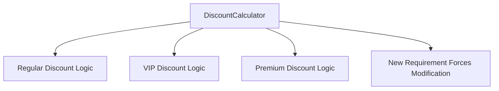
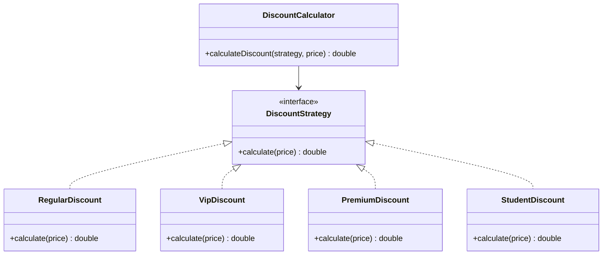
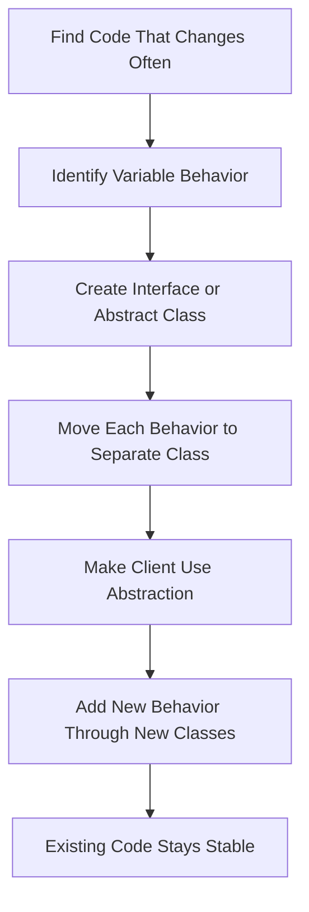

# Open/Closed Principle

## Note

The **Open/Closed Principle (OCP)** is the **O** in **SOLID**. It is not a design pattern by itself; it is an object-oriented design principle that helps software become easier to extend without repeatedly changing stable, tested code.

---

## 1. Definition

The **Open/Closed Principle** states that:

> **Software entities should be open for extension, but closed for modification.**

This means a class, module, function, or component should allow new behavior to be added without changing its existing source code. Microsoft’s MSDN guidance states the principle as “software entities should be open for extension but closed for modification.” ([Microsoft Learn][1])

In simple words:

> Add new behavior by adding new code, not by constantly editing old code.

---

## 2. Problem

A class violates OCP when every new requirement forces you to edit the same existing class.

### Bad Example

```java
class DiscountCalculator {

    public double calculateDiscount(String customerType, double price) {
        if (customerType.equals("REGULAR")) {
            return price * 0.10;
        } else if (customerType.equals("VIP")) {
            return price * 0.20;
        } else if (customerType.equals("PREMIUM")) {
            return price * 0.30;
        }

        return 0;
    }
}
```

### What is wrong here?

Every time a new customer type is added, the `DiscountCalculator` class must be modified.

For example, if the system later adds:

* Student customer
* Employee customer
* Holiday customer
* Loyalty customer

Then the same class keeps changing again and again.

This creates several risks:

* Existing logic may break.
* The class becomes larger over time.
* Testing becomes harder.
* Code becomes less flexible.
* New features require editing old code.

Microsoft’s OCP article explains that changing existing code can be more difficult and risky than adding new code, especially in an existing codebase. ([Microsoft Learn][1])

---

## 3. Solution

The solution is to depend on **abstractions**, such as interfaces or abstract classes, and add new behavior through new implementations.

Instead of modifying the existing calculator for every new discount type, create a common interface.

### Better Design

```java
interface DiscountStrategy {
    double calculate(double price);
}
```

```java
class RegularDiscount implements DiscountStrategy {

    public double calculate(double price) {
        return price * 0.10;
    }
}
```

```java
class VipDiscount implements DiscountStrategy {

    public double calculate(double price) {
        return price * 0.20;
    }
}
```

```java
class PremiumDiscount implements DiscountStrategy {

    public double calculate(double price) {
        return price * 0.30;
    }
}
```

```java
class DiscountCalculator {

    public double calculateDiscount(DiscountStrategy strategy, double price) {
        return strategy.calculate(price);
    }
}
```

Now, if a new discount type is needed, we add a new class instead of changing the existing calculator.

### Adding a New Discount

```java
class StudentDiscount implements DiscountStrategy {

    public double calculate(double price) {
        return price * 0.15;
    }
}
```

The existing `DiscountCalculator` does not need to change.

---

## 4. Structure

The Open/Closed Principle usually leads to a structure like this:

### Abstraction

Defines a common contract.

Example:

```java
interface DiscountStrategy
```

### Existing Implementation

Contains current behavior.

Example:

```java
RegularDiscount
VipDiscount
PremiumDiscount
```

### New Implementation

Adds new behavior without modifying existing code.

Example:

```java
StudentDiscount
```

### Client / Context Class

Uses the abstraction instead of depending directly on concrete classes.

Example:

```java
DiscountCalculator
```

---

## Bad Design Diagram



---

## Good Design Diagram



---

## Extension Flow Diagram


---

## 5. Applicability

Use the Open/Closed Principle when:

* New features often require changing the same class.
* A class contains many `if`, `else if`, or `switch` statements for different types.
* You expect behavior to grow over time.
* You want to reduce the risk of breaking tested code.
* You want to make the system easier to extend.
* You want to support plugins, strategies, rules, or multiple implementations.
* You want client code to depend on interfaces rather than concrete classes.

OCP works especially well with design patterns such as:

| Pattern                 | How it supports OCP                                     |
| ----------------------- | ------------------------------------------------------- |
| Strategy Pattern        | Add new strategies without changing the context class   |
| Factory Method Pattern  | Add new products/creators without modifying client code |
| Template Method Pattern | Extend algorithm steps through subclasses               |
| Decorator Pattern       | Add behavior by wrapping objects                        |
| Observer Pattern        | Add new subscribers without changing the subject        |

The original OCP article by Robert C. Martin states the principle in terms of software entities being open for extension but closed for modification, and focuses on avoiding changes that ripple through existing code. ([objectmentor.com][2])

---

## 6. How to Implement

To implement the Open/Closed Principle:

1. Identify code that changes frequently.
2. Look for repeated `if`, `else if`, or `switch` logic.
3. Create an interface or abstract class for the changing behavior.
4. Move each behavior into its own implementation class.
5. Make the main class depend on the abstraction.
6. Add new behavior by creating new classes.
7. Avoid modifying stable, tested code unless the existing behavior itself is wrong.
8. Use design patterns such as Strategy, Factory Method, or Decorator when appropriate.

---

## Implementation Steps Diagram



---

## 7. Pros and Cons

### Pros

* Makes code easier to extend.
* Reduces the risk of breaking existing functionality.
* Encourages use of abstractions.
* Improves maintainability.
* Supports cleaner architecture.
* Helps reduce large conditional blocks.
* Makes adding new features safer.
* Works well with polymorphism and dependency injection.

Microsoft’s article explains that OCP is useful because extending an existing codebase should be closer to writing new code rather than repeatedly changing old code. ([Microsoft Learn][1])

### Cons

* Can increase the number of classes.
* Can make simple code more complex than necessary.
* Requires good abstraction design.
* Wrong abstractions can make the system harder to maintain.
* It can be overused when future change is unlikely.
* Some changes still require modifying existing code, especially when the original abstraction was incomplete.

OCP does not mean you should never modify code. It means stable code should be designed so common extensions can happen without editing the original implementation.

---

## Example in Test Automation

OCP is useful in automation frameworks when different browsers, environments, reports, or test data sources may be added later.

### Bad Example

```java
class DriverManager {

    public WebDriver createDriver(String browser) {
        if (browser.equals("chrome")) {
            return new ChromeDriver();
        } else if (browser.equals("firefox")) {
            return new FirefoxDriver();
        } else if (browser.equals("edge")) {
            return new EdgeDriver();
        }

        throw new IllegalArgumentException("Unsupported browser");
    }
}
```

This class must be modified every time a new browser or execution type is added.

---

### Better Example

```java
interface DriverFactory {
    WebDriver createDriver();
}
```

```java
class ChromeDriverFactory implements DriverFactory {

    public WebDriver createDriver() {
        return new ChromeDriver();
    }
}
```

```java
class FirefoxDriverFactory implements DriverFactory {

    public WebDriver createDriver() {
        return new FirefoxDriver();
    }
}
```

```java
class DriverManager {

    public WebDriver createDriver(DriverFactory factory) {
        return factory.createDriver();
    }
}
```

Now a new browser can be added by creating a new factory class instead of changing the existing `DriverManager`.

---

## Open/Closed Principle vs Single Responsibility Principle

| Point           | Single Responsibility Principle               | Open/Closed Principle                                       |
| --------------- | --------------------------------------------- | ----------------------------------------------------------- |
| SOLID Letter    | S                                             | O                                                           |
| Main idea       | A class should have one reason to change      | A class should be extendable without modification           |
| Focus           | Responsibility and cohesion                   | Extension and stability                                     |
| Main question   | “Why does this class change?”                 | “Can I add behavior without editing this class?”            |
| Common solution | Split unrelated responsibilities              | Use abstraction and polymorphism                            |
| Example         | Separate `EmployeeRepository` from `Employee` | Add `StudentDiscount` without changing `DiscountCalculator` |

---

## Common Mistake

A common mistake is thinking that OCP means existing code should **never** be changed.

That is not correct.

You should still modify existing code when:

* There is a bug.
* The existing behavior is wrong.
* The abstraction no longer fits the system.
* Requirements fundamentally change.
* The design was too early or too complex.

OCP is mainly about designing stable parts of the system so expected extensions can be added safely.

---

## Summary

The **Open/Closed Principle** says that software should be **open for extension** but **closed for modification**. This means new behavior should usually be added through new classes, interfaces, or implementations instead of repeatedly changing existing stable code. OCP helps reduce risk, improve maintainability, and make systems easier to extend over time.

---

## Trusted Sources

* Microsoft Learn / MSDN Magazine — Patterns in Practice: The Open Closed Principle. ([Microsoft Learn][1])
* Robert C. Martin / Object Mentor — The Open-Closed Principle. ([objectmentor.com][2])
* Stackify — SOLID Design Principles Explained: The Open/Closed Principle with Code Examples. ([stackify.com][3])

[1]: https://learn.microsoft.com/en-us/archive/msdn-magazine/2008/june/patterns-in-practice-the-open-closed-principle?utm_source=chatgpt.com "Patterns in Practice: The Open Closed Principle"
[2]: https://objectmentor.com/resources/articles/ocp.pdf?utm_source=chatgpt.com "The Open-Closed Principle"
[3]: https://stackify.com/solid-design-open-closed-principle/?utm_source=chatgpt.com "The Open/Closed Principle with Code Examples"
