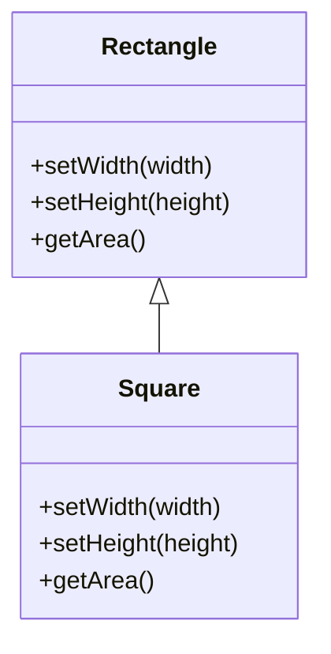
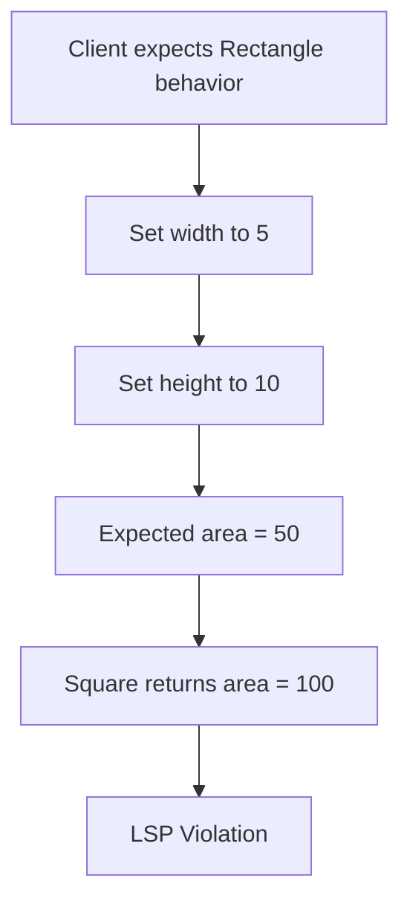
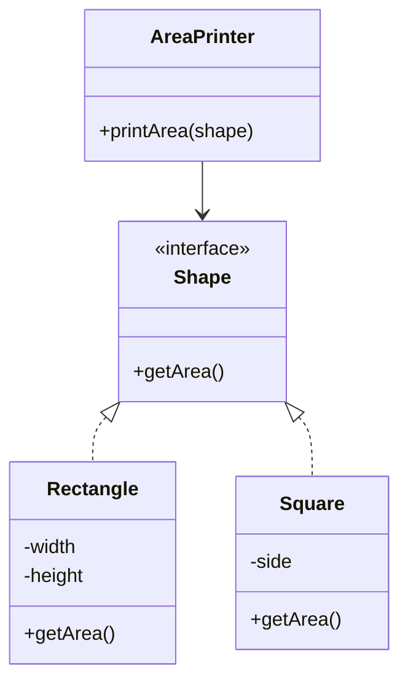
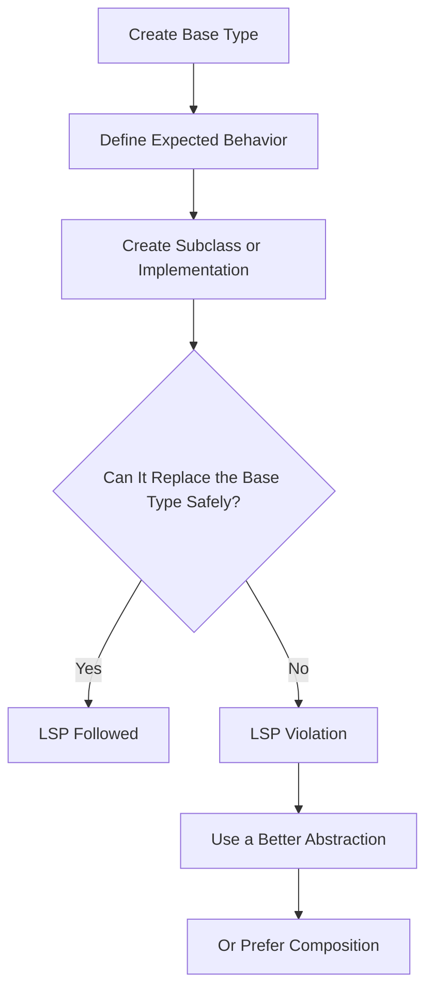

# Liskov Substitution Principle

> A SOLID design principle that says a subtype must be safely usable anywhere its parent type is expected, without breaking the correctness of the program.

---

## Table of Contents

- [Note](#note)
- [Historical Note on SOLID](#historical-note-on-solid)
- [Definition](#1-definition)
- [Problem](#2-problem)
- [Solution](#3-solution)
- [Structure](#4-structure)
- [Applicability](#5-applicability)
- [How to Implement](#6-how-to-implement)
- [Pros and Cons](#7-pros-and-cons)
- [Example in Test Automation](#8-example-in-test-automation)
- [Liskov Substitution Principle vs Open/Closed Principle](#9-liskov-substitution-principle-vs-openclosed-principle)
- [Common Mistakes](#10-common-mistakes)
- [Summary](#summary)
- [References](#references)

---

## Note

The **Liskov Substitution Principle (LSP)** is the **L** in **SOLID**.

It is **not a GoF design pattern**. It is an object-oriented design principle used to create safe inheritance and reliable polymorphism.

LSP is mainly about **safe substitution**:

> A child class should be usable anywhere its parent class is expected, without surprising the client code or breaking expected behavior.

The principle is named after **Barbara Liskov**. Barbara Liskov and Jeannette Wing later formalized the idea through **behavioral subtyping**, where subtypes must preserve behavioral properties expected from their supertypes.

---

## Historical Note on SOLID

The **SOLID principles** are most commonly associated with **Robert C. Martin**, also known as **Uncle Bob**, because he collected, explained, and popularized these object-oriented design principles.

However, it is more accurate to say:

- **Robert C. Martin** collected, explained, and popularized the five principles as a practical object-oriented design set.
- **Michael Feathers** is commonly credited with arranging/coining the acronym **SOLID**.
- **Bertrand Meyer** is credited with the original **Open/Closed Principle**.
- **Barbara Liskov** is credited with the original substitution idea behind **LSP**.
- **Barbara Liskov and Jeannette Wing** formalized the idea as **behavioral subtyping**.

So, avoid saying:

> Robert C. Martin invented SOLID.

A better sentence is:

> The SOLID principles are commonly associated with Robert C. Martin, who collected and popularized them, while the acronym SOLID is commonly credited to Michael Feathers.

---

## 1. Definition

The **Liskov Substitution Principle** states that objects of a superclass should be replaceable with objects of a subclass without affecting the correctness of the program.

In simple words:

> If class `B` extends class `A`, then any code that works with `A` should also work correctly with `B`.

This means inheritance is not only about sharing methods. It is also about preserving behavior.

A subclass should not:

- Remove behavior expected from the parent.
- Change the meaning of inherited methods.
- Require stricter input than the parent.
- Return weaker results than the parent promises.
- Throw unexpected exceptions for behavior the parent supports.
- Break assumptions that client code safely makes about the parent type.

---

## 2. Problem

A class violates LSP when a subclass does not behave correctly as a replacement for its parent class.

A common example is the **Rectangle and Square problem**.

Mathematically, a square is a rectangle. But in object-oriented programming, making `Square` inherit from `Rectangle` can cause problems if the parent class allows width and height to change independently.

### Bad Example

```java
public class Rectangle {

    protected int width;
    protected int height;

    public void setWidth(int width) {
        this.width = width;
    }

    public void setHeight(int height) {
        this.height = height;
    }

    public int getArea() {
        return width * height;
    }
}
```

```java
public class Square extends Rectangle {

    @Override
    public void setWidth(int width) {
        this.width = width;
        this.height = width;
    }

    @Override
    public void setHeight(int height) {
        this.width = height;
        this.height = height;
    }
}
```

Now look at this client code:

```java
public class AreaChecker {

    public void checkArea(Rectangle rectangle) {
        rectangle.setWidth(5);
        rectangle.setHeight(10);

        if (rectangle.getArea() != 50) {
            throw new RuntimeException("Area is incorrect");
        }
    }
}
```

This works with `Rectangle`, but fails with `Square`.

Why?

Because `Square` changes both width and height together.

After this code runs:

```java
rectangle.setWidth(5);
rectangle.setHeight(10);
```

A `Rectangle` has an area of `50`.

A `Square` has an area of `100`.

So `Square` cannot safely replace `Rectangle` in this design. This violates LSP.

---

## 3. Solution

The solution is to avoid inheritance when the subclass cannot fully behave like the parent class.

Instead of forcing `Square` to inherit from `Rectangle`, create a smaller abstraction that both classes can support correctly.

### Better Design

```java
public interface Shape {
    int getArea();
}
```

```java
public class Rectangle implements Shape {

    private final int width;
    private final int height;

    public Rectangle(int width, int height) {
        this.width = width;
        this.height = height;
    }

    @Override
    public int getArea() {
        return width * height;
    }
}
```

```java
public class Square implements Shape {

    private final int side;

    public Square(int side) {
        this.side = side;
    }

    @Override
    public int getArea() {
        return side * side;
    }
}
```

```java
public class AreaPrinter {

    public void printArea(Shape shape) {
        System.out.println(shape.getArea());
    }
}
```

Now both `Rectangle` and `Square` can safely be used as `Shape`.

The abstraction only promises `getArea()`, and both classes can fulfill that promise correctly.

---

## 4. Structure

LSP usually leads to this structure:

### Base Type

The base type defines behavior that all subtypes must safely support.

Example:

```java
Shape
```

### Subtype

The subtype implements the base behavior without breaking client expectations.

Examples:

```java
Rectangle
Square
```

### Client Code

The client code depends on the base type and expects all subtypes to behave correctly.

Example:

```java
AreaPrinter
```

---

## Bad Design Diagram



### Why This Is Bad



---

## Good Design Diagram



---

## 5. Applicability

Use the Liskov Substitution Principle when:

- You are designing inheritance relationships.
- You are creating subclasses from a base class.
- You are using interfaces or abstract classes.
- You want polymorphism to work safely.
- You want child classes to behave consistently with parent classes.
- You want to avoid surprising behavior from inherited classes.
- You want to prevent subclasses from weakening the parent class contract.
- You need to decide whether inheritance or composition is better.

LSP is especially important in:

- Framework base classes.
- Page objects and page abstractions.
- Driver factories.
- Service layers.
- Strategy implementations.
- API clients.
- Test data providers.
- Report generators.
- Any polymorphic design where client code depends on a common type.

---

## 6. How to Implement

To implement the Liskov Substitution Principle:

1. Define the expected behavior of the base type clearly.
2. Make sure every subtype can fully support that behavior.
3. Do not override methods in a way that changes the expected meaning.
4. Do not make subclass methods require stricter inputs than the parent.
5. Do not make subclass methods return weaker results than the parent promises.
6. Do not throw unexpected exceptions for behavior the parent supports.
7. Do not force subclasses to implement methods they cannot honestly support.
8. Use smaller interfaces when only some classes support certain behavior.
9. Prefer composition over inheritance when the “is-a” relationship is not behaviorally correct.
10. Write tests that run the same behavioral checks against all implementations of the base type.

A useful question is:

> “Can I pass this subclass anywhere the parent class is expected without breaking the program?”

If the answer is no, the design probably violates LSP.

---

## Implementation Steps Diagram



---

## 7. Pros and Cons

### ✅ Pros

- Makes inheritance safer.
- Improves reliability of polymorphic code.
- Reduces unexpected behavior from subclasses.
- Supports the Open/Closed Principle.
- Makes code easier to test.
- Helps create better abstractions.
- Prevents incorrect “is-a” relationships.
- Encourages clear contracts between parent and child types.

### ❌ Cons

- Can be difficult to detect early.
- Requires thinking about behavior, not only class names.
- Some real-world relationships do not work well as inheritance relationships.
- May require more interfaces.
- May require composition instead of inheritance.
- Can make the design feel more abstract.
- Developers may incorrectly assume that real-world “is-a” always means code inheritance.

For example, a square **is a** rectangle in mathematics, but it may not safely behave as a `Rectangle` class in code if `Rectangle` allows independent width and height changes.

---

## 8. Example in Test Automation

LSP is useful in automation frameworks when different implementations should behave consistently.

### Bad Example

```java
public class BasePage {

    protected WebDriver driver;

    public BasePage(WebDriver driver) {
        this.driver = driver;
    }

    public void open() {
        driver.get("https://example.com");
    }

    public void clickSave() {
        driver.findElement(By.id("save")).click();
    }
}
```

```java
public class ReadOnlyProfilePage extends BasePage {

    public ReadOnlyProfilePage(WebDriver driver) {
        super(driver);
    }

    @Override
    public void clickSave() {
        throw new UnsupportedOperationException("Save is not available on read-only page");
    }
}
```

### What Is Wrong?

`ReadOnlyProfilePage` extends `BasePage`, but it cannot support `clickSave()`.

Any test or framework utility that expects a `BasePage` may call `clickSave()` and fail unexpectedly.

```java
public class PageActions {

    public void savePage(BasePage page) {
        page.clickSave();
    }
}
```

This violates LSP because the child class cannot safely replace the parent class.

---

### Better Design

Separate the common behavior from editable behavior.

```java
public interface Page {
    void open();
}
```

```java
public interface EditablePage extends Page {
    void clickSave();
}
```

```java
public class ProfileViewPage implements Page {

    private WebDriver driver;

    public ProfileViewPage(WebDriver driver) {
        this.driver = driver;
    }

    @Override
    public void open() {
        driver.get("https://example.com/profile");
    }
}
```

```java
public class ProfileEditPage implements EditablePage {

    private WebDriver driver;

    private By saveButton = By.id("save");

    public ProfileEditPage(WebDriver driver) {
        this.driver = driver;
    }

    @Override
    public void open() {
        driver.get("https://example.com/profile/edit");
    }

    @Override
    public void clickSave() {
        driver.findElement(saveButton).click();
    }
}
```

Now only editable pages expose `clickSave()`.

Read-only pages are not forced to inherit behavior they cannot correctly support.

This also connects to the **Interface Segregation Principle**, because small focused interfaces help avoid forcing classes to implement methods they do not need.

---

### TestNG Example

```java
import org.testng.annotations.Test;

public class ProfileEditTest extends BaseTest {

    @Test
    public void userCanSaveProfileChanges() {
        ProfileEditPage profileEditPage = new ProfileEditPage(driver);

        profileEditPage.open();
        profileEditPage.clickSave();
    }
}
```

```java
import org.testng.annotations.Test;

public class ProfileViewTest extends BaseTest {

    @Test
    public void userCanOpenProfileViewPage() {
        ProfileViewPage profileViewPage = new ProfileViewPage(driver);

        profileViewPage.open();
    }
}
```

This design is safer because each page exposes only behavior it can truly support.

---

## 9. Liskov Substitution Principle vs Open/Closed Principle

| Point | Liskov Substitution Principle | Open/Closed Principle |
|---|---|---|
| SOLID Letter | L | O |
| Main idea | Subclasses must safely replace parent classes | Code should be extendable without modifying stable code |
| Focus | Correct inheritance and polymorphism | Safe extension |
| Main question | “Can the child class replace the parent?” | “Can I add behavior without changing existing code?” |
| Common solution | Better abstractions or composition | Interfaces, polymorphism, and new implementations |
| Example | `Square` should not break `Rectangle` behavior | Add `StudentDiscount` without changing `DiscountCalculator` |
| Risk if ignored | Runtime surprises from subclasses | Repeated changes to tested code |

LSP helps OCP work correctly.

If subclasses break parent expectations, then adding new implementations through OCP can still break the system.

---

## 10. Common Mistakes

### Mistake 1: Thinking inheritance is always correct because the names sound related

A child class should not inherit from a parent class only because it sounds like a real-world “is-a” relationship.

The relationship must also be behaviorally correct in code.

---

### Mistake 2: Throwing unsupported exceptions

```java
@Override
public void save() {
    throw new UnsupportedOperationException();
}
```

If the parent type promises `save()`, the child type should not remove that behavior.

---

### Mistake 3: Strengthening preconditions

```java
@Override
public void upload(File file) {
    if (!file.getName().endsWith(".pdf")) {
        throw new IllegalArgumentException("Only PDF files are allowed");
    }
}
```

If the parent method accepts any file, the child method should not suddenly accept only PDF files.

---

### Mistake 4: Weakening postconditions

If the parent method promises to return a non-null object, the child method should not return `null`.

```java
@Override
public User getUser() {
    return null;
}
```

---

### Mistake 5: Changing expected behavior

```java
@Override
public void setWidth(int width) {
    this.width = width;
    this.height = width;
}
```

This may look valid syntactically, but it changes the behavior expected from the parent class.

---

### Mistake 6: Using a big parent class for all child classes

If only some child classes support a behavior, do not put that behavior in the parent class.

Use smaller interfaces instead.

Bad:

```java
public abstract class BasePage {
    public abstract void open();
    public abstract void clickSave();
    public abstract void delete();
}
```

Better:

```java
public interface Page {
    void open();
}

public interface EditablePage extends Page {
    void clickSave();
}

public interface DeletablePage extends Page {
    void delete();
}
```

---

## Summary

The **Liskov Substitution Principle** says that subclasses must be safely replaceable for their parent classes without breaking the program.

It is not enough for a subclass to share the same methods. It must also preserve the expected behavior of the parent type.

LSP helps developers design safer inheritance, better abstractions, and more reliable polymorphic code. In automation frameworks, it helps prevent base page classes, driver factories, and shared interfaces from forcing child classes to support behavior they cannot honestly provide.

---

## References

| Source | Link |
|---|---|
| Barbara Liskov and Jeannette Wing — *A Behavioral Notion of Subtyping* | https://www.cs.cmu.edu/~wing/publications/LiskovWing94.pdf |
| ACM Digital Library — *A Behavioral Notion of Subtyping* | https://dl.acm.org/doi/10.1145/197320.197383 |
| Microsoft Learn / MSDN Magazine — Code Contracts, Inheritance, and the Liskov Principle | https://learn.microsoft.com/en-us/archive/msdn-magazine/2011/july/msdn-magazine-cutting-edge-code-contracts-inheritance-and-the-liskov-principle |
| Robert C. Martin — Principles of Object-Oriented Design | https://butunclebob.com/ArticleS.UncleBob.PrinciplesOfOod |
| InfoQ Podcast — Uncle Bob Martin on Origins of SOLID | https://www.infoq.com/podcasts/uncle-bob-solid-ddd/ |
| Robert C. Martin — The Single Responsibility Principle | https://blog.cleancoder.com/uncle-bob/2014/05/08/SingleReponsibilityPrinciple.html |
| Robert C. Martin — The Open Closed Principle | https://blog.cleancoder.com/uncle-bob/2014/05/12/TheOpenClosedPrinciple.html |
| Baeldung — Liskov Substitution Principle in Java | https://www.baeldung.com/java-liskov-substitution-principle |
