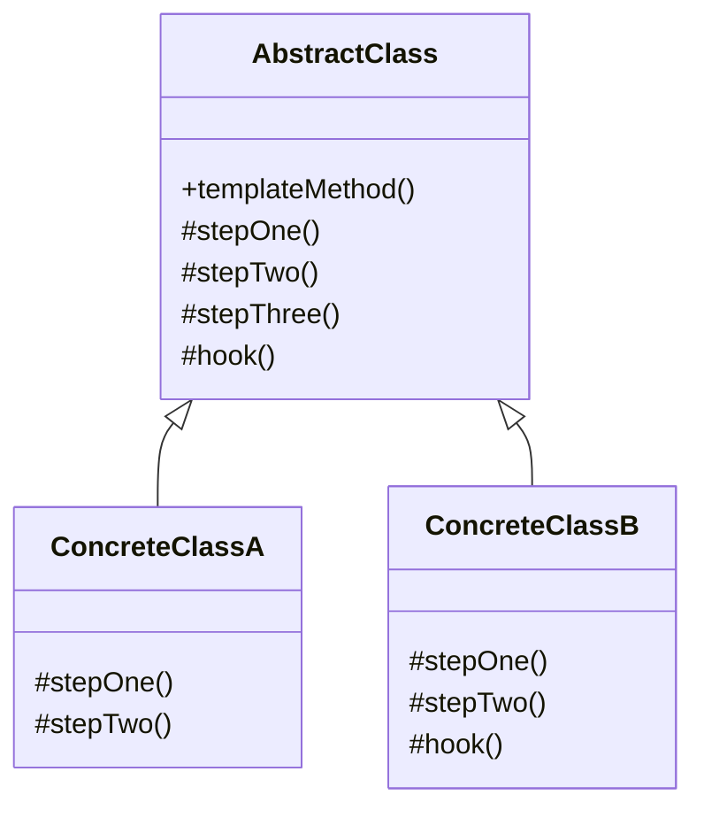
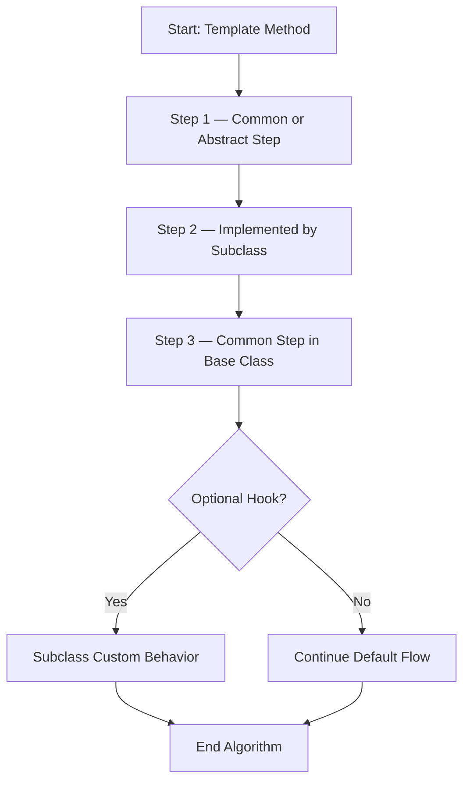
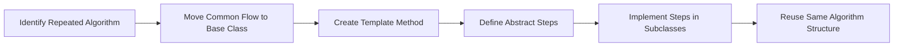

# Template Method Pattern

> A behavioral design pattern that defines the skeleton of an algorithm in a superclass, letting subclasses override specific steps without changing the overall structure.

---

## Table of Contents

- [Definition](#1-definition)
- [Problem](#2-problem)
- [Solution](#3-solution)
- [Structure](#4-structure)
- [Applicability](#5-applicability)
- [How to Implement](#6-how-to-implement)
- [Pros and Cons](#7-pros-and-cons)
- [Summary](#summary)
- [References](#references)

---

## 1. Definition

The **Template Method Pattern** is a **behavioral design pattern** that defines the **skeleton of an algorithm** in a superclass, while allowing subclasses to override specific steps without changing the overall structure.

It is called **Template Method** because the main method acts like a fixed template for the algorithm.

---

## 2. Problem

Sometimes several classes follow the **same general process**, but some steps differ.

**Example:** An application that processes different file types — PDF, CSV, and DOC — where each type needs a different way to read or extract data, but the overall workflow is the same:

1. Open the file
2. Extract data
3. Analyze data
4. Generate a report
5. Close the file

Without this pattern:
- Code is duplicated across multiple classes.
- If the common workflow changes, every class must be updated separately.

---

## 3. Solution

Place the **fixed algorithm structure** in a base class and let subclasses customize only the steps that vary.

The superclass contains the **template method**, which defines the order of operations. Subclasses implement or override specific steps but do not change the overall flow.

### Example

```java
abstract class DataProcessor {

    // Template method — defines the algorithm skeleton
    public final void process() {
        openFile();
        extractData();
        analyzeData();
        generateReport();
        closeFile();
    }

    protected abstract void openFile();
    protected abstract void extractData();

    protected void analyzeData() {
        System.out.println("Analyze data using common logic");
    }

    protected void generateReport() {
        System.out.println("Generate report using common logic");
    }

    protected void closeFile() {
        System.out.println("Close file");
    }
}

class CSVProcessor extends DataProcessor {

    @Override
    protected void openFile() {
        System.out.println("Open CSV file");
    }

    @Override
    protected void extractData() {
        System.out.println("Extract data from CSV file");
    }
}

class PDFProcessor extends DataProcessor {

    @Override
    protected void openFile() {
        System.out.println("Open PDF file");
    }

    @Override
    protected void extractData() {
        System.out.println("Extract data from PDF file");
    }
}
```

---

## 4. Structure

### Components

| Component | Role |
|---|---|
| **Abstract Class** | Defines the template method and the common algorithm structure |
| **Template Method** | Defines the order of execution; marked `final` to prevent override |
| **Abstract Methods** | Steps that **must** be implemented by subclasses |
| **Concrete Classes** | Inherit from abstract class; provide implementations for variable steps |
| **Hooks** | Optional methods subclasses can override for extra customization |

### Class Diagram



### Algorithm Flow



---

## 5. Applicability

Use the Template Method Pattern when:

- Multiple classes share the **same overall algorithm**.
- Some steps of the algorithm **differ between subclasses**.
- You want to **avoid duplicated code**.
- You want to **control algorithm order** from a base class.
- Subclasses should customize behavior **without changing the main workflow**.

### Real-World Examples

- **Spring `JdbcTemplate`** — handles the main JDBC workflow while application code provides specific callback logic such as creating statements or processing result rows.
- **Java `AbstractList`** — a skeletal implementation of the `List` interface that minimizes implementation effort. Subclasses provide `get()` and `size()`, while the abstract class provides reusable structure.

---

## 6. How to Implement



**Step-by-step:**

1. Identify the algorithm with a fixed sequence of steps.
2. Move the common structure into an abstract superclass.
3. Create a template method that calls steps in order.
4. Put shared behavior inside concrete methods in the superclass.
5. Declare variable steps as `abstract` methods.
6. Allow subclasses to override only the steps that change.
7. Add hook methods if optional customization is needed.
8. Mark the template method as `final` to protect the algorithm order.

---

## 7. Pros and Cons

### ✅ Pros

- Reduces duplicated code.
- Keeps algorithm structure consistent across subclasses.
- Allows subclasses to customize specific steps freely.
- Makes common behavior easier to maintain in one place.
- Supports the **Open/Closed Principle** — new subclasses add behavior without modifying the base algorithm.

### ❌ Cons

- Relies heavily on **inheritance**, which can be rigid.
- Subclasses are constrained by the structure defined in the superclass.
- The base class can grow complex when the algorithm has many steps.
- Changing the template method impacts **all subclasses**.
- Less flexible than composition-based alternatives such as the **Strategy Pattern**.
- Can violate the **Liskov Substitution Principle (LSP)** — if a subclass overrides a step in a way that breaks the expected behavior of the base class, the subclass can no longer safely replace it.

---

## Summary

The **Template Method Pattern** is useful when different classes follow the same overall process but need different implementations for some steps. The superclass controls the algorithm structure while subclasses provide specific behavior — making the design more reusable, consistent, and easier to maintain.

---

## References

| Source | Link |
|---|---|
| Refactoring.Guru — Template Method Pattern | https://refactoring.guru/design-patterns/template-method |
| Microsoft Learn — Design Patterns: Template Method | https://learn.microsoft.com/en-us/shows/visual-studio-toolbox/design-patterns-template-method |
| Spring Docs — `JdbcTemplate` | https://docs.spring.io/spring-framework/docs/current/javadoc-api/org/springframework/jdbc/core/JdbcTemplate.html |
| Oracle Java Docs — `AbstractList` | https://docs.oracle.com/javase/8/docs/api/java/util/AbstractList.html |