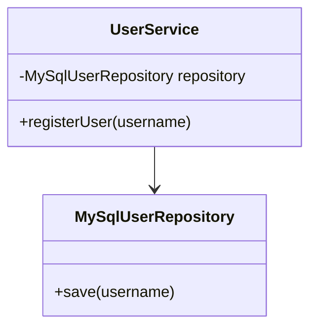
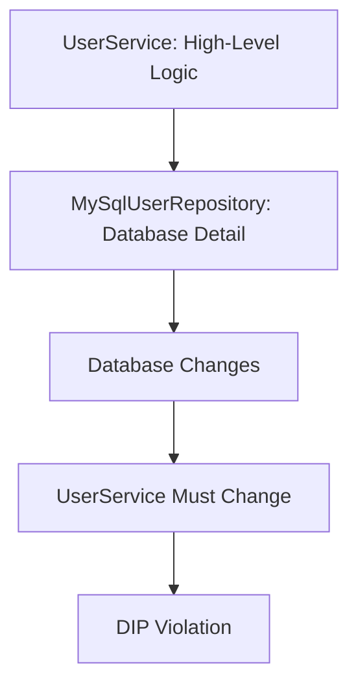
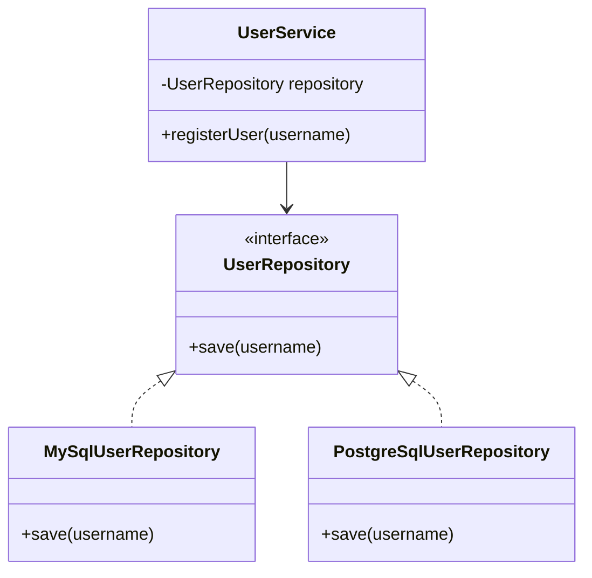
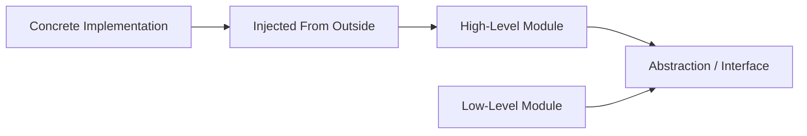
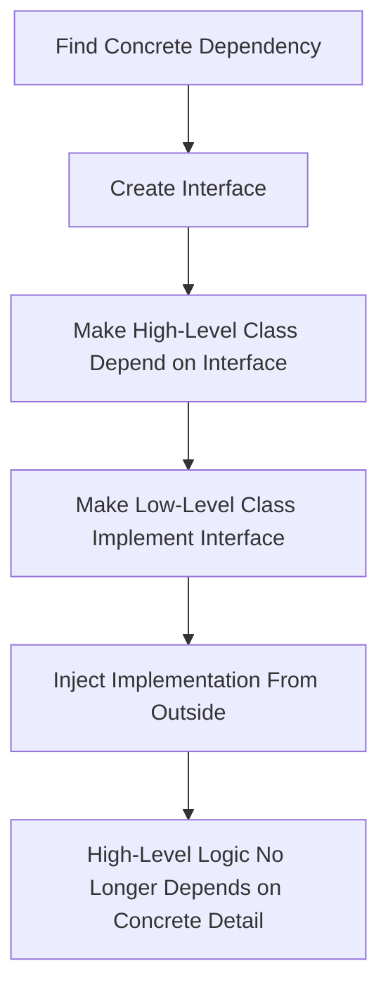

# Dependency Inversion Principle

> A SOLID design principle that says high-level modules should not depend on low-level modules; both should depend on abstractions.

---

## Table of Contents

- [Note](#note)
- [Historical Note on SOLID](#historical-note-on-solid)
- [Definition](#1-definition)
- [Problem](#2-problem)
- [Solution](#3-solution)
- [Structure](#4-structure)
- [Applicability](#5-applicability)
- [How to Implement](#6-how-to-implement)
- [Pros and Cons](#7-pros-and-cons)
- [Example in Test Automation](#8-example-in-test-automation)
- [Dependency Inversion Principle vs Dependency Injection](#9-dependency-inversion-principle-vs-dependency-injection)
- [Dependency Inversion Principle vs Open/Closed Principle](#10-dependency-inversion-principle-vs-openclosed-principle)
- [Common DIP Violations](#11-common-dip-violations)
- [Summary](#summary)
- [References](#references)

---

## Note

The **Dependency Inversion Principle (DIP)** is the **D** in **SOLID**.

It is **not the same thing** as **Dependency Injection (DI)**.

The difference is important:

- **Dependency Inversion Principle (DIP)** is a design principle.
- **Dependency Injection (DI)** is one common technique used to apply DIP.
- **Inversion of Control (IoC)** is a broader idea where control of object creation or flow is moved outside the class.

In simple words:

> DIP tells you what dependency direction should look like. DI is one way to wire those dependencies.

---

## Historical Note on SOLID

The **SOLID principles** are most commonly associated with **Robert C. Martin**, also known as **Uncle Bob**, because he collected, explained, and popularized these object-oriented design principles.

However, it is more accurate to say:

- **Robert C. Martin** collected, explained, and popularized the five principles as a practical object-oriented design set.
- **Michael Feathers** is commonly credited with arranging/coining the acronym **SOLID**.
- **Bertrand Meyer** is credited with the original **Open/Closed Principle**.
- **Barbara Liskov** is credited with the original substitution idea behind **Liskov Substitution Principle**.
- **Robert C. Martin** is credited with the **Dependency Inversion Principle**.

So, avoid saying:

> Robert C. Martin invented SOLID.

A better sentence is:

> The SOLID principles are commonly associated with Robert C. Martin, who collected and popularized them, while the acronym SOLID is commonly credited to Michael Feathers.

---

## 1. Definition

The **Dependency Inversion Principle** states that:

> **High-level modules should not depend on low-level modules. Both should depend on abstractions.**

It also states that:

> **Abstractions should not depend on details. Details should depend on abstractions.**

In simple words:

> Important business logic should not directly depend on concrete technical details such as databases, files, APIs, browsers, or frameworks.

### What Is a High-Level Module?

A **high-level module** contains important business rules, workflow logic, or application logic.

Examples:

```java
UserService
OrderService
PaymentService
LoginTestFlow
```

### What Is a Low-Level Module?

A **low-level module** contains technical implementation details.

Examples:

```java
MySqlUserRepository
StripePaymentGateway
CsvFileReader
ChromeDriver
ExtentReportGenerator
```

DIP says high-level logic should not directly depend on those concrete details. Instead, both sides should depend on abstractions.

---

## 2. Problem

A class violates DIP when high-level logic directly creates or depends on low-level implementation details.

### Bad Example

```java
public class MySqlUserRepository {

    public void save(String username) {
        System.out.println("Saving user to MySQL: " + username);
    }
}
```

```java
public class UserService {

    private MySqlUserRepository repository = new MySqlUserRepository();

    public void registerUser(String username) {
        repository.save(username);
    }
}
```

### What Is Wrong Here?

`UserService` is a high-level class because it contains application/business logic.

`MySqlUserRepository` is a low-level class because it handles a technical detail: saving data to MySQL.

The problem is that `UserService` directly depends on `MySqlUserRepository`.

This creates several issues:

- Changing from MySQL to PostgreSQL requires modifying `UserService`.
- Unit testing `UserService` becomes harder.
- The business logic is tightly coupled to infrastructure.
- Reusing `UserService` with another storage system becomes difficult.
- The class creates its own dependency instead of receiving it from outside.

---

## 3. Solution

The solution is to introduce an abstraction, such as an interface, between the high-level module and the low-level implementation.

### Better Design

```java
public interface UserRepository {
    void save(String username);
}
```

```java
public class MySqlUserRepository implements UserRepository {

    @Override
    public void save(String username) {
        System.out.println("Saving user to MySQL: " + username);
    }
}
```

```java
public class UserService {

    private final UserRepository repository;

    public UserService(UserRepository repository) {
        this.repository = repository;
    }

    public void registerUser(String username) {
        repository.save(username);
    }
}
```

Now `UserService` depends on the `UserRepository` abstraction, not the concrete `MySqlUserRepository`.

A different implementation can be added without changing `UserService`.

```java
public class PostgreSqlUserRepository implements UserRepository {

    @Override
    public void save(String username) {
        System.out.println("Saving user to PostgreSQL: " + username);
    }
}
```

### Wiring the Dependency

```java
public class Main {

    public static void main(String[] args) {
        UserRepository repository = new MySqlUserRepository();
        UserService userService = new UserService(repository);

        userService.registerUser("omar");
    }
}
```

Here, `UserService` does not create the repository itself. The dependency is provided from outside through the constructor.

This is **constructor injection**, one common way to apply DIP.

---

## 4. Structure

The Dependency Inversion Principle usually contains these parts:

### High-Level Module

Contains important business rules or application logic.

Example:

```java
UserService
```

### Abstraction

Defines what the high-level module needs, without saying how it is done.

Example:

```java
UserRepository
```

### Low-Level Module

Contains technical implementation details.

Examples:

```java
MySqlUserRepository
PostgreSqlUserRepository
```

### Dependency Injection / Wiring Code

Provides the concrete implementation to the high-level module from outside.

Example:

```java
new UserService(new MySqlUserRepository());
```

---

## Bad Design Diagram



### Why This Is Bad



---

## Good Design Diagram



---

## Dependency Flow Diagram



---

## 5. Applicability

Use the Dependency Inversion Principle when:

- A business class directly creates concrete dependencies using `new`.
- A service directly depends on a database, API client, file system, browser driver, or framework class.
- You want to replace implementations without changing business logic.
- You want to improve unit testing.
- You want to mock or fake dependencies in tests.
- You want to separate business logic from infrastructure logic.
- You want to support multiple implementations of the same behavior.
- You want a cleaner layered architecture.
- You want high-level code to remain stable when technical details change.

DIP is especially useful in:

- Service layers.
- Repository layers.
- API clients.
- Report generators.
- Payment gateways.
- Email/SMS notification services.
- Selenium driver creation.
- Test data providers.
- Logging/reporting integrations.

---

## 6. How to Implement

To implement the Dependency Inversion Principle:

1. Identify high-level business or workflow classes.
2. Identify concrete dependencies used by those classes.
3. Create an interface or abstraction for each dependency.
4. Make the high-level class depend on the abstraction.
5. Make the low-level class implement the abstraction.
6. Inject the dependency from outside, usually through a constructor.
7. Avoid creating concrete dependencies directly inside the high-level class.
8. Keep wiring code in a composition root, factory, framework configuration, or test setup.
9. Use a dependency injection container if the project is large.
10. Avoid creating interfaces for every class automatically; create abstractions where replacement, testing, or architectural separation is useful.

### Constructor Injection Example

```java
public interface EmailSender {
    void sendEmail(String to, String message);
}
```

```java
public class SmtpEmailSender implements EmailSender {

    @Override
    public void sendEmail(String to, String message) {
        System.out.println("Sending email using SMTP");
    }
}
```

```java
public class NotificationService {

    private final EmailSender emailSender;

    public NotificationService(EmailSender emailSender) {
        this.emailSender = emailSender;
    }

    public void notifyUser(String email, String message) {
        emailSender.sendEmail(email, message);
    }
}
```

```java
public class Main {

    public static void main(String[] args) {
        EmailSender sender = new SmtpEmailSender();
        NotificationService service = new NotificationService(sender);

        service.notifyUser("user@example.com", "Welcome!");
    }
}
```

---

## Implementation Steps Diagram



---

## 7. Pros and Cons

### ✅ Pros

- Reduces tight coupling.
- Makes code easier to test.
- Makes dependencies easier to replace.
- Keeps business logic independent from infrastructure details.
- Supports cleaner layered architecture.
- Makes mocking and stubbing easier in unit tests.
- Works well with dependency injection containers.
- Helps support Open/Closed Principle because new implementations can be added without modifying high-level logic.
- Makes code easier to reuse with different implementations.

### ❌ Cons

- Can add more interfaces and classes.
- Can feel unnecessary in small projects.
- Poorly designed abstractions can make code harder to understand.
- Too much dependency injection can make object creation harder to trace.
- Dependency injection containers may add configuration complexity.
- Overusing DIP can create unnecessary abstraction.
- Developers may confuse DIP with DI and think using a DI container automatically means good design.

DIP should be used where dependency changes, testing needs, or architectural separation justify the extra abstraction.

---

## 8. Example in Test Automation

DIP is very useful in Selenium automation frameworks because test framework logic should not be tightly coupled to one browser, report system, or data source.

### Bad Example

```java
import org.openqa.selenium.chrome.ChromeDriver;

public class LoginTest {

    private ChromeDriver driver = new ChromeDriver();

    public void testLogin() {
        driver.get("https://automationexercise.com/login");
    }
}
```

### What Is Wrong?

`LoginTest` directly depends on `ChromeDriver`.

If the test needs to run on Firefox, Edge, RemoteWebDriver, or Selenium Grid, the test class must change.

---

### Better Design

Create a driver abstraction for browser creation.

```java
import org.openqa.selenium.WebDriver;

public interface DriverProvider {
    WebDriver createDriver();
}
```

```java
import org.openqa.selenium.WebDriver;
import org.openqa.selenium.chrome.ChromeDriver;

public class ChromeDriverProvider implements DriverProvider {

    @Override
    public WebDriver createDriver() {
        return new ChromeDriver();
    }
}
```

```java
import org.openqa.selenium.WebDriver;
import org.openqa.selenium.firefox.FirefoxDriver;

public class FirefoxDriverProvider implements DriverProvider {

    @Override
    public WebDriver createDriver() {
        return new FirefoxDriver();
    }
}
```

```java
import org.openqa.selenium.WebDriver;

public class BaseTest {

    protected WebDriver driver;

    public BaseTest(DriverProvider driverProvider) {
        this.driver = driverProvider.createDriver();
    }
}
```

Now the test depends on `DriverProvider` and `WebDriver` abstractions instead of directly depending on one specific browser driver implementation.

---

### Practical TestNG Version

In real TestNG projects, test classes usually should not receive constructor parameters directly unless you are intentionally using TestNG factories.

A practical version is to keep the wiring in `BaseTest`.

```java
import org.openqa.selenium.WebDriver;
import org.testng.annotations.AfterMethod;
import org.testng.annotations.BeforeMethod;

public abstract class BaseTest {

    protected WebDriver driver;

    @BeforeMethod
    public void setUp() {
        DriverProvider driverProvider = DriverProviderFactory.getProvider(
                System.getProperty("browser", "chrome")
        );

        driver = driverProvider.createDriver();
    }

    @AfterMethod
    public void tearDown() {
        if (driver != null) {
            driver.quit();
        }
    }
}
```

```java
public class DriverProviderFactory {

    public static DriverProvider getProvider(String browser) {
        if (browser.equalsIgnoreCase("chrome")) {
            return new ChromeDriverProvider();
        }

        if (browser.equalsIgnoreCase("firefox")) {
            return new FirefoxDriverProvider();
        }

        throw new IllegalArgumentException("Unsupported browser: " + browser);
    }
}
```

```java
import org.testng.annotations.Test;

public class LoginTest extends BaseTest {

    @Test
    public void userCanOpenLoginPage() {
        driver.get("https://automationexercise.com/login");
    }
}
```

### Important Note

The factory still contains browser-selection logic.

That is acceptable as a **composition point** where concrete implementations are wired together.

The important improvement is that the test itself no longer depends directly on `ChromeDriver`.

---

## 9. Dependency Inversion Principle vs Dependency Injection

| Point | Dependency Inversion Principle | Dependency Injection |
|---|---|---|
| Type | Design principle | Implementation technique / pattern |
| SOLID Letter | D | Not a SOLID principle by itself |
| Main idea | Depend on abstractions, not concrete details | Provide dependencies from outside the class |
| Goal | Reduce coupling between high-level and low-level modules | Move dependency creation and wiring outside the class |
| Example | `UserService` depends on `UserRepository` | `UserRepository` is passed through the constructor |
| Tool required? | No | No container required, but containers can help |
| Relationship | The principle | One common way to apply the principle |

### Important Distinction

You can use Dependency Injection without properly following DIP.

Bad example:

```java
public class UserService {

    private final MySqlUserRepository repository;

    public UserService(MySqlUserRepository repository) {
        this.repository = repository;
    }
}
```

The dependency is injected, but `UserService` still depends on the concrete `MySqlUserRepository`.

A better DIP-based version is:

```java
public class UserService {

    private final UserRepository repository;

    public UserService(UserRepository repository) {
        this.repository = repository;
    }
}
```

Now the class receives the dependency from outside and depends on an abstraction.

---

## 10. Dependency Inversion Principle vs Open/Closed Principle

| Point | Dependency Inversion Principle | Open/Closed Principle |
|---|---|---|
| SOLID Letter | D | O |
| Main idea | Depend on abstractions instead of concrete implementations | Extend behavior without modifying stable code |
| Focus | Direction of dependencies | Safe extension |
| Common solution | Interfaces and dependency injection | Polymorphism and new implementations |
| Example | `UserService` depends on `UserRepository` | Add `PostgreSqlUserRepository` without changing `UserService` |
| Connection | Enables flexible dependencies | Benefits from those abstractions |

DIP often helps OCP.

When high-level classes depend on abstractions, new implementations can be added without changing the high-level logic.

---

## 11. Common DIP Violations

### 1. Creating Concrete Dependencies Inside a Class

```java
public class OrderService {
    private PaymentGateway gateway = new StripePaymentGateway();
}
```

### 2. Depending Directly on Infrastructure

```java
public class ReportService {
    private MySqlConnection connection;
}
```

### 3. Making Business Logic Depend on Framework Details

```java
public class UserService {
    private HttpServletRequest request;
}
```

### 4. Hard-Coding Test Framework Details

```java
public class BaseTest {
    private ChromeDriver driver = new ChromeDriver();
}
```

### 5. Injecting a Concrete Class Instead of an Abstraction

```java
public class PaymentService {

    private final StripePaymentGateway gateway;

    public PaymentService(StripePaymentGateway gateway) {
        this.gateway = gateway;
    }
}
```

This uses injection, but still violates the spirit of DIP because the high-level service depends on a concrete payment provider.

---

## Better DIP-Based Design

```java
public interface PaymentGateway {
    void pay(double amount);
}
```

```java
public class StripePaymentGateway implements PaymentGateway {

    @Override
    public void pay(double amount) {
        System.out.println("Paying with Stripe");
    }
}
```

```java
public class PayPalPaymentGateway implements PaymentGateway {

    @Override
    public void pay(double amount) {
        System.out.println("Paying with PayPal");
    }
}
```

```java
public class OrderService {

    private final PaymentGateway paymentGateway;

    public OrderService(PaymentGateway paymentGateway) {
        this.paymentGateway = paymentGateway;
    }

    public void placeOrder(double amount) {
        paymentGateway.pay(amount);
    }
}
```

This design allows `OrderService` to work with Stripe, PayPal, test fakes, or future payment providers without modifying the business logic.

---

## Summary

The **Dependency Inversion Principle** says that high-level modules should not depend directly on low-level modules. Both should depend on abstractions.

It protects important business logic from being tightly coupled to technical details such as databases, APIs, frameworks, browsers, and external services.

In practice, DIP is often implemented using interfaces and constructor-based Dependency Injection. This makes software easier to test, extend, and maintain.

In Selenium automation frameworks, DIP helps keep tests and framework logic independent from concrete browser drivers, report tools, and data-source implementations.

---

## References

| Source | Link |
|---|---|
| Robert C. Martin — *The Dependency Inversion Principle* | https://objectmentor.com/resources/articles/dip.pdf |
| Robert C. Martin — Principles of Object-Oriented Design | https://butunclebob.com/ArticleS.UncleBob.PrinciplesOfOod |
| InfoQ Podcast — Uncle Bob Martin on Origins of SOLID | https://www.infoq.com/podcasts/uncle-bob-solid-ddd/ |
| Microsoft Learn — Dependency Injection in .NET | https://learn.microsoft.com/en-us/dotnet/core/extensions/dependency-injection/overview |
| Microsoft Learn — ASP.NET Core Dependency Injection | https://learn.microsoft.com/en-us/aspnet/core/fundamentals/dependency-injection |
| Microsoft Learn — Common Web Application Architectures | https://learn.microsoft.com/en-us/dotnet/architecture/modern-web-apps-azure/common-web-application-architectures |
| Microsoft Learn — Microservice Application Layer and DIP | https://learn.microsoft.com/en-us/dotnet/architecture/microservices/microservice-ddd-cqrs-patterns/microservice-application-layer-web-api-design |
| Spring Official Documentation — Dependency Injection | https://docs.spring.io/spring-framework/reference/core/beans/dependencies/factory-collaborators.html |
| Martin Fowler — DIP in the Wild | https://martinfowler.com/articles/dipInTheWild.html |
| Baeldung — Dependency Inversion Principle | https://www.baeldung.com/cs/dip |
