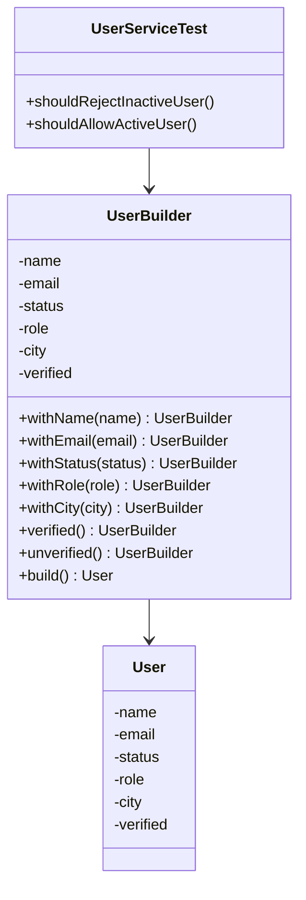

# Builder Pattern for Test Data

> A testing pattern that uses builder-style object creation to create readable, flexible test data with valid defaults and simple overrides.

---

## Table of Contents

- [Note](#note)
- [Definition](#1-definition)
- [Problem](#2-problem)
- [Solution](#3-solution)
- [Structure](#4-structure)
- [Applicability](#5-applicability)
- [How to Implement](#6-how-to-implement)
- [Simple Java TestNG Example](#7-simple-java-testng-example)
- [Pros and Cons](#8-pros-and-cons)
- [Test Data Builder vs Object Mother](#9-test-data-builder-vs-object-mother)
- [Best Practices](#10-best-practices)
- [Example with Nested Objects](#11-example-with-nested-objects)
- [Example in Test Automation](#12-example-in-test-automation)
- [Common Mistakes](#13-common-mistakes)
- [Summary](#summary)
- [References](#references)

---

## Note

The **Builder Pattern for Test Data** is more commonly called the **Test Data Builder Pattern**.

It is **not a GoF pattern by itself**. It is a testing pattern inspired by the classic **Builder design pattern**.

The classic Builder pattern is a creational design pattern used to construct complex objects step by step. In testing, the same idea is adapted to create test objects with:

- Valid default values
- Fluent override methods
- A clear `build()` method
- Setup code that shows only the data important to the test

In simple words:

> The classic Builder pattern helps construct complex objects.  
> The Test Data Builder pattern helps tests construct complex test objects clearly.

---

## 1. Definition

The **Test Data Builder Pattern** is a test automation and unit testing pattern used to create test objects in a clean, readable, and flexible way.

Instead of writing long object setup code inside every test, you create a builder class that provides:

- Default valid values
- Fluent methods to override specific fields
- A `build()` method to create the final test object

In simple words:

> A Test Data Builder creates test objects with sensible defaults, while allowing each test to change only the values that matter.

This helps keep test setup readable and focused.

---

## 2. Problem

Tests often need complex objects before they can run.

For example, a test may need a `User` object:

```java
User user = new User(
        "Ahmed",
        "ahmed@example.com",
        "ACTIVE",
        "ADMIN",
        "Cairo",
        true
);
```

This becomes a problem when:

- The object has many required fields.
- Most fields are not important for the test.
- The same setup is repeated in many tests.
- Constructor arguments are hard to understand.
- Changes to the model break many tests.
- Test setup becomes longer than the actual test logic.
- The test reader cannot quickly understand which value matters.

### Example Problem

```java
@Test
public void shouldRejectInactiveUser() {
    User user = new User(
            "Ahmed",
            "ahmed@example.com",
            "INACTIVE",
            "CUSTOMER",
            "Cairo",
            false
    );

    boolean result = userService.canLogin(user);

    Assert.assertFalse(result);
}
```

The important detail is:

```java
"INACTIVE"
```

But it is hidden among many unrelated values.

---

## 3. Solution

The solution is to create a **test builder class** that knows how to create a valid default object.

Each test can then override only the values that matter.

### With Test Data Builder

```java
@Test
public void shouldRejectInactiveUser() {
    User user = new UserBuilder()
            .withStatus("INACTIVE")
            .build();

    boolean result = userService.canLogin(user);

    Assert.assertFalse(result);
}
```

Now the test clearly shows what matters:

> The user is inactive.

The other values still exist, but they are hidden behind valid defaults.

---

## 4. Structure

The Test Data Builder Pattern usually contains these parts:

### Product / Test Object

The object needed by the test.

Example:

```java
User
```

### Test Data Builder

A separate class used mainly in tests to create the object.

Example:

```java
UserBuilder
```

### Default Values

Valid values used when the test does not care about a specific field.

Example:

```java
name = "Default User"
email = "user@example.com"
status = "ACTIVE"
role = "CUSTOMER"
city = "Cairo"
verified = true
```

### Fluent Override Methods

Methods that change only one part of the object.

Example:

```java
withStatus("INACTIVE")
withRole("ADMIN")
withEmail("test@example.com")
```

### Build Method

The method that returns the final object.

Example:

```java
build()
```

---

## Structure Diagram



---

## Test Data Builder Flow Diagram

```mermaid
flowchart TD
    A[Test Starts] --> B[Create Builder]
    B --> C[Builder Provides Default Valid Data]
    C --> D[Test Overrides Only Important Fields]
    D --> E[Call build()]
    E --> F[Use Object in Test]
    F --> G[Assert Behavior]
```

---

## 5. Applicability

Use the Test Data Builder Pattern when:

- Tests need complex objects.
- Many tests repeat the same object creation code.
- Constructors have many parameters.
- Most test data fields are irrelevant to the test.
- You want test setup to clearly show only important values.
- You want valid default objects for most test cases.
- You need many small variations of the same object.
- Object Mother methods are becoming too many or too specific.
- Test setup is making tests hard to read.
- Nested objects are common in your test data.

Use it carefully when:

- The object is very simple.
- The test needs all values to be explicit.
- The builder would add more noise than clarity.

---

## 6. How to Implement

To implement a Test Data Builder:

1. Choose the test object that is hard to create.
2. Create a builder class in the test project.
3. Add private fields matching the object fields.
4. Give each field a valid default value.
5. Add fluent `with...()` methods for fields that tests may customize.
6. Make each fluent method return `this`.
7. Add a `build()` method that creates and returns the final object.
8. Use the builder inside tests instead of direct constructors.
9. Keep the builder focused on test data creation, not business logic.
10. Update the builder when the test object changes.

---

## Implementation Steps Diagram


---

## 7. Simple Java TestNG Example

### User Class

```java
public class User {

    private final String name;
    private final String email;
    private final String status;
    private final String role;
    private final String city;
    private final boolean verified;

    public User(String name, String email, String status, String role, String city, boolean verified) {
        this.name = name;
        this.email = email;
        this.status = status;
        this.role = role;
        this.city = city;
        this.verified = verified;
    }

    public String getName() {
        return name;
    }

    public String getEmail() {
        return email;
    }

    public String getStatus() {
        return status;
    }

    public String getRole() {
        return role;
    }

    public String getCity() {
        return city;
    }

    public boolean isVerified() {
        return verified;
    }
}
```

---

### UserService Class

```java
public class UserService {

    public boolean canLogin(User user) {
        return user.getStatus().equals("ACTIVE") && user.isVerified();
    }
}
```

---

### UserBuilder Class

```java
public class UserBuilder {

    private String name = "Default User";
    private String email = "user@example.com";
    private String status = "ACTIVE";
    private String role = "CUSTOMER";
    private String city = "Cairo";
    private boolean verified = true;

    public UserBuilder withName(String name) {
        this.name = name;
        return this;
    }

    public UserBuilder withEmail(String email) {
        this.email = email;
        return this;
    }

    public UserBuilder withStatus(String status) {
        this.status = status;
        return this;
    }

    public UserBuilder withRole(String role) {
        this.role = role;
        return this;
    }

    public UserBuilder withCity(String city) {
        this.city = city;
        return this;
    }

    public UserBuilder verified() {
        this.verified = true;
        return this;
    }

    public UserBuilder unverified() {
        this.verified = false;
        return this;
    }

    public User build() {
        return new User(name, email, status, role, city, verified);
    }
}
```

---

### TestNG Test Class

```java
import org.testng.Assert;
import org.testng.annotations.Test;

public class UserServiceTest {

    private UserService userService = new UserService();

    @Test
    public void shouldAllowActiveVerifiedUserToLogin() {
        User user = new UserBuilder()
                .withStatus("ACTIVE")
                .verified()
                .build();

        boolean result = userService.canLogin(user);

        Assert.assertTrue(result);
    }

    @Test
    public void shouldRejectInactiveUser() {
        User user = new UserBuilder()
                .withStatus("INACTIVE")
                .build();

        boolean result = userService.canLogin(user);

        Assert.assertFalse(result);
    }

    @Test
    public void shouldRejectUnverifiedUser() {
        User user = new UserBuilder()
                .unverified()
                .build();

        boolean result = userService.canLogin(user);

        Assert.assertFalse(result);
    }
}
```

The test setup becomes shorter, and each test highlights only the field that matters.

---

## 8. Pros and Cons

### ✅ Pros

- Makes tests more readable.
- Reduces duplicated setup code.
- Hides irrelevant test data.
- Makes object creation flexible.
- Helps tests focus on the behavior being tested.
- Makes it easier to create small variations of test objects.
- Reduces the need for many Object Mother methods.
- Works well with fluent test style.
- Helps when objects have many fields or nested objects.

### ❌ Cons

- Adds extra builder classes to the test project.
- Builders must be maintained when the domain object changes.
- Too many builders can make the test framework feel heavy.
- Poor defaults can hide important test assumptions.
- Builders can become complex if they start containing business logic.
- Overusing builders for very simple objects can be unnecessary.

A good rule:

> Use Test Data Builders when object setup is complex, repeated, or noisy.

---

## 9. Test Data Builder vs Object Mother

| Point | Test Data Builder | Object Mother |
|---|---|---|
| Main idea | Build objects with defaults and fluent overrides | Provide predefined example objects |
| Flexibility | High | Medium |
| Best for | Many variations of the same object | Common fixed examples |
| Test readability | Shows only changed fields clearly | Very readable for common examples |
| Risk | Many builder classes | Too many factory methods |
| Example | `new UserBuilder().withStatus("INACTIVE").build()` | `UserMother.inactiveUser()` |

Object Mother is useful when tests need common predefined examples.

Test Data Builder is usually better when each test needs a slightly different object.

---

## 10. Best Practices

### Use Meaningful Defaults

```java
private String status = "ACTIVE";
private boolean verified = true;
```

Defaults should create a valid object unless the test intentionally overrides something.

---

### Show Only Important Test Data

```java
User inactiveUser = new UserBuilder()
        .withStatus("INACTIVE")
        .build();
```

This makes the purpose of the test clear.

---

### Use Fluent Method Names

```java
.withRole("ADMIN")
.unverified()
.withCity("Cairo")
```

Good names make test setup read like a sentence.

---

### Keep Builders in Test Code

Test Data Builders usually belong in the test project, not production code, because their main purpose is to support tests.

---

### Avoid Business Logic Inside Builders

The builder should create data. It should not decide business rules.

Bad:

```java
public UserBuilder makeEligibleForPremiumDiscount() {
    this.role = "VIP";
    this.verified = true;
    this.totalOrders = 100;
    return this;
}
```

Better:

```java
public UserBuilder withRole(String role) {
    this.role = role;
    return this;
}
```

Special helper methods are acceptable only when the domain meaning is very common and improves readability.

---

## 11. Example with Nested Objects

Test data often contains nested objects, such as an `Order` with a `Customer`.

### Customer Class

```java
public class Customer {

    private final String name;
    private final String email;

    public Customer(String name, String email) {
        this.name = name;
        this.email = email;
    }
}
```

---

### CustomerBuilder Class

```java
public class CustomerBuilder {

    private String name = "Default Customer";
    private String email = "customer@example.com";

    public CustomerBuilder withName(String name) {
        this.name = name;
        return this;
    }

    public CustomerBuilder withEmail(String email) {
        this.email = email;
        return this;
    }

    public Customer build() {
        return new Customer(name, email);
    }
}
```

---

### Order Class

```java
public class Order {

    private final Customer customer;
    private final double totalAmount;
    private final String status;

    public Order(Customer customer, double totalAmount, String status) {
        this.customer = customer;
        this.totalAmount = totalAmount;
        this.status = status;
    }

    public double getTotalAmount() {
        return totalAmount;
    }

    public String getStatus() {
        return status;
    }
}
```

---

### OrderBuilder Class

```java
public class OrderBuilder {

    private Customer customer = new CustomerBuilder().build();
    private double totalAmount = 100.00;
    private String status = "NEW";

    public OrderBuilder withCustomer(Customer customer) {
        this.customer = customer;
        return this;
    }

    public OrderBuilder withTotalAmount(double totalAmount) {
        this.totalAmount = totalAmount;
        return this;
    }

    public OrderBuilder withStatus(String status) {
        this.status = status;
        return this;
    }

    public Order build() {
        return new Order(customer, totalAmount, status);
    }
}
```

---

### Test Using Nested Builders

```java
import org.testng.Assert;
import org.testng.annotations.Test;

public class OrderServiceTest {

    private OrderService orderService = new OrderService();

    @Test
    public void shouldApproveLargeOrderForVerifiedCustomer() {
        Customer customer = new CustomerBuilder()
                .withEmail("verified@example.com")
                .build();

        Order order = new OrderBuilder()
                .withCustomer(customer)
                .withTotalAmount(5000.00)
                .build();

        boolean result = orderService.canApprove(order);

        Assert.assertTrue(result);
    }
}
```

This keeps complex test data readable while still allowing control over important fields.

---

## 12. Example in Test Automation

Test Data Builders are useful in Selenium and API automation when tests need repeated input data.

### Bad Example

```java
@Test
public void userCanRegister() {
    RegisterPage registerPage = new RegisterPage(driver);

    registerPage.open();
    registerPage.register(
            "Omar",
            "omar" + System.currentTimeMillis() + "@test.com",
            "P@ssw0rd",
            "Cairo",
            "Egypt",
            "01000000000"
    );
}
```

The test contains too many data details.

---

### Better Design

Create a test data object.

```java
public class RegisterUserData {

    private final String name;
    private final String email;
    private final String password;
    private final String city;
    private final String country;
    private final String mobileNumber;

    public RegisterUserData(String name, String email, String password, String city, String country, String mobileNumber) {
        this.name = name;
        this.email = email;
        this.password = password;
        this.city = city;
        this.country = country;
        this.mobileNumber = mobileNumber;
    }

    public String getName() {
        return name;
    }

    public String getEmail() {
        return email;
    }

    public String getPassword() {
        return password;
    }

    public String getCity() {
        return city;
    }

    public String getCountry() {
        return country;
    }

    public String getMobileNumber() {
        return mobileNumber;
    }
}
```

Create a builder for it.

```java
public class RegisterUserDataBuilder {

    private String name = "Default User";
    private String email = "user" + System.currentTimeMillis() + "@test.com";
    private String password = "P@ssw0rd";
    private String city = "Cairo";
    private String country = "Egypt";
    private String mobileNumber = "01000000000";

    public RegisterUserDataBuilder withName(String name) {
        this.name = name;
        return this;
    }

    public RegisterUserDataBuilder withEmail(String email) {
        this.email = email;
        return this;
    }

    public RegisterUserDataBuilder withPassword(String password) {
        this.password = password;
        return this;
    }

    public RegisterUserDataBuilder withCity(String city) {
        this.city = city;
        return this;
    }

    public RegisterUserDataBuilder withCountry(String country) {
        this.country = country;
        return this;
    }

    public RegisterUserDataBuilder withMobileNumber(String mobileNumber) {
        this.mobileNumber = mobileNumber;
        return this;
    }

    public RegisterUserData build() {
        return new RegisterUserData(name, email, password, city, country, mobileNumber);
    }
}
```

Use it inside a TestNG test.

```java
import org.testng.annotations.Test;

public class RegisterTest extends BaseTest {

    @Test
    public void userCanRegisterWithValidData() {
        RegisterUserData userData = new RegisterUserDataBuilder()
                .withName("Omar")
                .build();

        RegisterPage registerPage = new RegisterPage(driver);

        registerPage.open();
        registerPage.register(userData);
    }
}
```

Now the test shows only the important change:

```java
.withName("Omar")
```

The remaining registration data is handled by safe defaults.

---

## 13. Common Mistakes

### 1. Builder Has No Default Values

Bad:

```java
User user = new UserBuilder()
        .withName("Ahmed")
        .withEmail("ahmed@example.com")
        .withStatus("ACTIVE")
        .withRole("CUSTOMER")
        .withCity("Cairo")
        .verified()
        .build();
```

This removes much of the benefit because every test still provides all data.

---

### 2. Builder Hides Important Test Data

```java
User user = new UserBuilder().build();
```

This is fine only when the exact data does not matter.

If status, role, or verification matters, the test should show it clearly.

---

### 3. Builder Becomes a Second Domain Model

The builder should not duplicate too much business behavior from production code.

It should help tests create objects, not become a parallel implementation of the system.

---

### 4. Using Builders for Very Simple Objects

For simple objects with one or two fields, direct construction may be clearer.

```java
Money price = new Money(100, "USD");
```

A builder is most valuable when setup is complex, repeated, or noisy.

---

### 5. Putting Production Rules Inside Test Builders

Bad:

```java
public OrderBuilder withDiscountRulesApplied() {
    if (totalAmount > 1000) {
        this.status = "DISCOUNTED";
    }

    return this;
}
```

The test builder should not reimplement production rules.

---

## Summary

The **Builder Pattern for Test Data**, also known as the **Test Data Builder Pattern**, helps tests create complex objects with readable defaults and simple overrides.

It keeps test setup clean, reduces duplication, and makes each test focus on the data that matters.

It is especially useful when objects have many fields, nested structures, or many small variations across tests.

The key idea is:

> Hide irrelevant data behind valid defaults, and show only the values important to the test.

---

## References

| Source | Link |
|---|---|
| Nat Pryce — Test Data Builders: an alternative to the Object Mother pattern | https://www.natpryce.com/articles/000714.html |
| Refactoring.Guru — Builder Design Pattern | https://refactoring.guru/design-patterns/builder |
| Martin Fowler — Object Mother | https://martinfowler.com/bliki/ObjectMother.html |
| Mark Seemann — Test Data Builders in C# | https://blog.ploeh.dk/2017/08/15/test-data-builders-in-c/ |
| Mark Seemann — From Test Data Builders to the identity functor | https://blog.ploeh.dk/2017/08/14/from-test-data-builders-to-the-identity-functor/ |
| Ardalis — Improve Tests with the Builder Pattern for Test Data | https://ardalis.com/improve-tests-with-the-builder-pattern-for-test-data/ |
| xUnitPatterns.com — xUnit Test Patterns index | https://xunitpatterns.com/ |
